# MuFun Architecture Overview

## What is MuFun?

MuFun is a **multimodal foundation model** that can "listen" to music and "talk" about what it hears. Think of it as an AI system that combines the ability to understand audio (like a music expert's ears) with the ability to generate natural language responses (like a knowledgeable music critic's brain).

**In simple terms**: You give MuFun a song and ask it a question like "What genre is this?" or "Describe the mood of this music," and it will analyze the audio and respond with a coherent text answer.

### What Can MuFun Do?

- **Genre Classification**: Identify whether a song is blues, jazz, rock, classical, etc.
- **Music Description**: Describe the mood, tempo, instruments, and characteristics of a song
- **Lyric Recognition**: Listen to songs and transcribe or discuss their lyrics
- **Music Comparison**: Compare multiple songs and explain their similarities or differences
- **Segment Analysis**: Analyze specific portions of a song (e.g., "How is the rhythm in the first 30 seconds?")

### Real-World Example

```
You: "Listen to this song and tell me its genre."
MuFun: "This is a blues song with a slow tempo and melancholic melody, 
        featuring guitar and harmonica."
```

## The Three-Component Architecture

MuFun works like a relay team with three specialized components, each doing one job really well:

```mermaid
graph LR
    A[🎵 Audio File<br/>song.mp3] --> B[👂 Whisper Encoder<br/>The Ears]
    B --> C[🔄 Connector BLP<br/>The Translator]
    C --> D[🧠 Qwen3 LLM<br/>The Brain]
    D --> E[💬 Text Output<br/>This is a blues song]
    
    style A fill:#e1f5ff
    style B fill:#ffe1e1
    style C fill:#fff4e1
    style D fill:#e1ffe1
    style E fill:#f0e1ff
```



### Component 1: The Ears (Whisper Encoder)

**What it does**: Listens to the audio and converts sound waves into numerical features that capture what the music sounds like.

**Analogy**: Like a music expert who can hear a song and mentally note down all its characteristics - the pitch, rhythm, instruments, and mood - but in a format that computers can understand.

**Technical name**: Whisper-large-v3 audio encoder

### Component 2: The Translator (Connector)

**What it does**: Translates the audio features from the "audio language" that Whisper speaks into the "text language" that the language model understands.

**Analogy**: Like an interpreter who translates between two people speaking different languages. The Whisper encoder speaks "Audio Language" and the Qwen3 LLM speaks "Text Language," so the Connector bridges the gap.

**Technical name**: BLP (Bi-Linear Projection) connector

### Component 3: The Brain (Qwen3 LLM)

**What it does**: Processes both the translated audio features and your text question together, then generates a coherent, intelligent response.

**Analogy**: Like a knowledgeable music critic who can understand both what they're hearing and what you're asking, then formulate a thoughtful answer.

**Technical name**: Qwen3-8B language model

## How Data Flows Through MuFun

Let's trace what happens when you ask MuFun about a 3-minute song:


### The Journey in Numbers

Here's what happens to a 3-minute song as it flows through MuFun:

1. **Raw Audio**: 2,880,000 numbers (samples) representing the sound wave
2. **After Whisper**: 3,600 "audio tokens" (each token = a small piece of the song)
3. **After Connector**: 3,600 audio tokens, now in a format the LLM understands
4. **Combined with Text**: Your question + 3,600 audio tokens = complete input
5. **LLM Output**: Generated text response describing the music

**Key insight**: The system converts continuous audio (sound waves) into discrete tokens (like words), so the language model can process audio and text together in the same way!

## What You'll Learn in This Documentation

This documentation will take you on a deep dive through MuFun's architecture, explaining each component in detail with visual diagrams, concrete examples, and simple analogies.

### Documentation Structure

1. **[00-overview.md](00-overview.md)** (You are here!)
   - High-level introduction to MuFun
   - The three-component architecture
   - How data flows through the system

2. **[01-audio-preprocessing.md](01-audio-preprocessing.md)**
   - How audio files are loaded and prepared
   - Resampling, chunking, and mel-spectrogram conversion
   - Dimension transformations with concrete examples

3. **[02-whisper-encoder.md](02-whisper-encoder.md)**
   - How Whisper "listens" to audio
   - Multi-layer feature extraction strategy
   - Pooling and concatenation operations
   - What each layer captures (acoustic → semantic)

4. **[03-connector.md](03-connector.md)**
   - How the Connector "translates" between modalities
   - BLP architecture layer-by-layer
   - Mathematical operations with actual numbers
   - Why the expansion-compression design works

5. **[04-qwen3-llm.md](04-qwen3-llm.md)**
   - How the language model processes audio + text
   - Text tokenization and embedding
   - Audio-text interleaving process
   - Causal attention and text generation

6. **[05-end-to-end-flow.md](05-end-to-end-flow.md)**
   - Complete pipeline from audio file to text output
   - Comprehensive dimension tracking table
   - Worked example with a 3-minute blues song
   - Memory requirements and performance considerations

7. **[06-key-concepts.md](06-key-concepts.md)**
   - Embeddings explained simply
   - Attention mechanism for beginners
   - Multimodal fusion concept
   - Causal generation process
   - Quick reference tables

8. **[07-code-examples.md](07-code-examples.md)**
   - Inference code examples
   - Data preparation formats
   - Single and multiple audio processing
   - Quantization for deployment
   - Training script examples

### Recommended Reading Order

**For Complete Beginners**:
1. Start here (00-overview.md) to get the big picture
2. Read 01-audio-preprocessing.md to understand how audio is prepared
3. Read 02-whisper-encoder.md to see how audio features are extracted
4. Read 03-connector.md to understand the translation step
5. Read 04-qwen3-llm.md to see how text generation works
6. Read 05-end-to-end-flow.md to see everything connected
7. Read 06-key-concepts.md for a summary and quick reference
8. Explore 07-code-examples.md when you're ready to use MuFun

**For Developers**:
1. Skim 00-overview.md for context
2. Jump to 07-code-examples.md for practical usage
3. Read 05-end-to-end-flow.md for the complete pipeline
4. Dive into specific components (01-04) as needed

**For Researchers**:
1. Read 00-overview.md for the architecture overview
2. Read 02-whisper-encoder.md for the multi-layer feature extraction strategy
3. Read 03-connector.md for the projection mechanism
4. Read 05-end-to-end-flow.md for dimension tracking
5. Refer to 06-key-concepts.md for technical details

## Key Takeaways

Before diving deeper, here are the most important concepts to remember:

1. **MuFun = Audio Understanding + Language Generation**
   - It combines an audio encoder (Whisper) with a language model (Qwen3)
   - This allows it to "listen" to music and "talk" about it

2. **Three Components Work Together**
   - Whisper extracts audio features (the ears)
   - Connector translates features to LLM space (the translator)
   - Qwen3 generates text responses (the brain)

3. **Audio Becomes Tokens**
   - Audio is converted into "tokens" just like text
   - 1 second of audio ≈ 10 tokens
   - The LLM processes audio tokens and text tokens together

4. **Multi-Layer Feature Extraction**
   - Whisper extracts features from multiple layers (0, 7, 15, 32)
   - Different layers capture different aspects of music
   - All features are combined for rich audio understanding

5. **Multimodal Fusion**
   - Audio and text are converted to the same numerical space
   - They're combined into a single sequence
   - The LLM processes them together seamlessly

## Getting Started

Ready to learn more? Head to **[01-audio-preprocessing.md](01-audio-preprocessing.md)** to start your journey through MuFun's architecture!

Or, if you want to jump straight into using MuFun, check out **[07-code-examples.md](07-code-examples.md)** for practical code examples.

---

**Note**: This documentation is designed to be beginner-friendly. We use simple analogies, visual diagrams, and concrete numerical examples throughout. Don't worry if you're not familiar with deep learning - we'll explain everything step by step!
