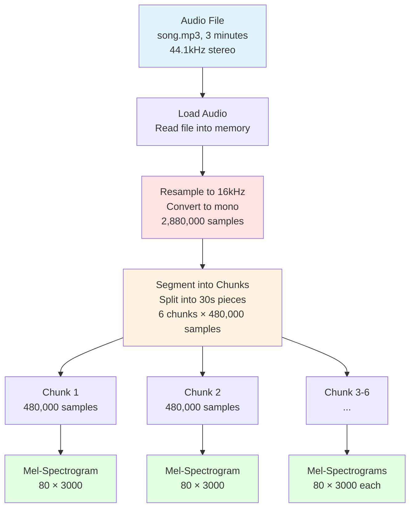
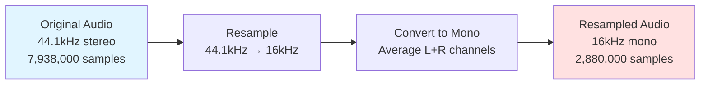
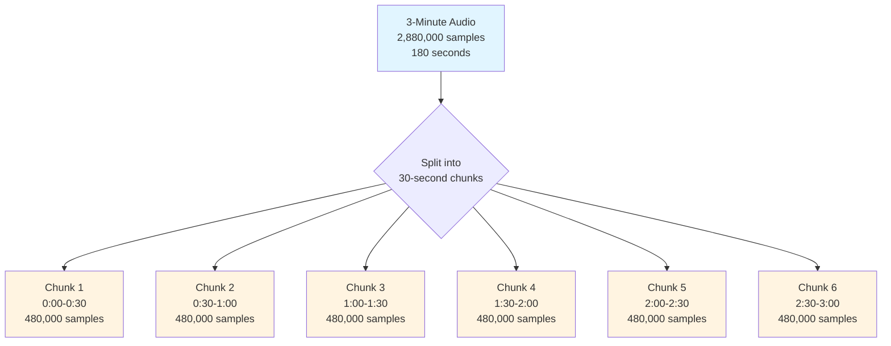
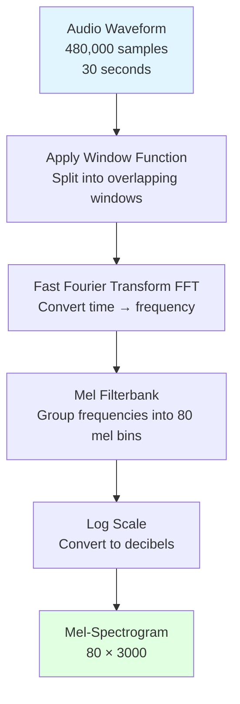

# Audio Preprocessing Pipeline

## Introduction

Before MuFun can understand music, it needs to convert raw audio files into a format that the neural network can process. Think of this like preparing ingredients before cooking - you need to wash, chop, and measure everything before you can start making a meal.

This document explains how MuFun transforms audio files (like MP3s or WAV files) into numerical representations that the Whisper encoder can understand.

## Overview of the Preprocessing Pipeline

The audio preprocessing pipeline consists of four main steps:

1. **Load Audio File**: Read the audio file from disk
2. **Resample to 16kHz**: Convert to a standard sampling rate
3. **Segment into Chunks**: Split long audio into 30-second pieces
4. **Convert to Mel-Spectrogram**: Transform waveform into a visual representation



## Step 1: Loading Audio Files

### What Happens

MuFun can load audio files in various formats including:
- **MP3**: Compressed audio format (most common)
- **WAV**: Uncompressed audio format (high quality)
- **FLAC**: Lossless compressed format
- **M4A/AAC**: Apple's audio format
- **OGG**: Open-source compressed format

### How It Works

Audio files are loaded using audio processing libraries (like `librosa` or `torchaudio`) that:
1. Decode the compressed audio format
2. Extract the raw audio waveform
3. Convert stereo to mono if needed
4. Return an array of amplitude values

### Example

```python
# Pseudocode for loading audio
audio_waveform, original_sample_rate = load_audio("blues_song.mp3")

# Result:
# audio_waveform: array of amplitude values (e.g., 13,230,000 samples)
# original_sample_rate: 44,100 Hz (CD quality)
```

**What is a waveform?**
A waveform is simply a list of numbers representing the air pressure at each moment in time. Positive numbers mean the speaker pushes out, negative numbers mean it pulls in.

Example for 0.1 seconds at 44.1kHz:
```
Time (seconds): [0.000, 0.000023, 0.000045, ..., 0.099977]
Amplitude:      [0.02,  -0.15,    0.31,     ..., -0.08   ]
                 ↑ 4,410 samples for 0.1 seconds
```

## Step 2: Resampling to 16kHz

### Why Resample?

Whisper was trained on audio sampled at **16,000 Hz** (16kHz). This means it expects 16,000 amplitude measurements per second. If your audio has a different sampling rate, we need to convert it.

**Common sampling rates:**
- 8kHz: Telephone quality
- 16kHz: Speech recognition standard (Whisper's rate)
- 44.1kHz: CD quality
- 48kHz: Professional audio/video

### What is Sampling Rate?

Think of sampling rate like frames per second in a video:
- **44.1kHz**: Taking 44,100 "snapshots" of sound per second
- **16kHz**: Taking 16,000 "snapshots" of sound per second

Higher sampling rates capture more detail but require more storage and processing power.

### The Resampling Process

Resampling converts between different sampling rates using signal processing techniques:

**Downsampling (44.1kHz → 16kHz):**
```
Original: 44,100 samples per second
Target:   16,000 samples per second
Ratio:    16,000 / 44,100 ≈ 0.363

For every 44,100 samples, we get 16,000 samples
```

**Mathematical Example:**

```
3-minute song at 44.1kHz:
Original samples = 3 minutes × 60 seconds × 44,100 samples/second
                 = 180 seconds × 44,100
                 = 7,938,000 samples

After resampling to 16kHz:
New samples = 3 minutes × 60 seconds × 16,000 samples/second
            = 180 seconds × 16,000
            = 2,880,000 samples

Reduction: 7,938,000 → 2,880,000 (about 36% of original size)
```

### Stereo to Mono Conversion

If the audio is stereo (left and right channels), it's converted to mono by averaging:

```
Stereo audio:
Left channel:  [0.5, -0.3, 0.8, ...]
Right channel: [0.3, -0.5, 0.6, ...]

Mono audio (average):
[(0.5+0.3)/2, (-0.3-0.5)/2, (0.8+0.6)/2, ...]
= [0.4, -0.4, 0.7, ...]
```

### Visual Representation



## Step 3: Segmenting into 30-Second Chunks

### Why Chunk Audio?

Whisper was designed to process audio in **30-second segments**. This is because:
1. **Memory constraints**: Processing very long audio requires too much memory
2. **Training data**: Whisper was trained on 30-second clips
3. **Attention mechanism**: Transformer models work better with fixed-length inputs

### The Chunking Strategy

**For audio longer than 30 seconds:**
- Split into multiple 30-second chunks
- Process each chunk independently
- Combine results at the end

**For audio shorter than 30 seconds:**
- Pad with silence to reach 30 seconds
- Process as a single chunk

### Calculating Chunk Size

At 16kHz sampling rate:
```
30 seconds × 16,000 samples/second = 480,000 samples per chunk
```

This is a fixed size that Whisper expects.

### Worked Example: 3-Minute Song

Let's trace through a complete example with a 3-minute blues song:

**Step-by-step calculation:**

```
Total duration: 3 minutes = 180 seconds
Sampling rate: 16,000 Hz
Total samples: 180 × 16,000 = 2,880,000 samples

Chunk size: 30 seconds = 480,000 samples
Number of chunks: 180 ÷ 30 = 6 chunks

Chunk breakdown:
- Chunk 1: samples 0 to 479,999 (0:00 - 0:30)
- Chunk 2: samples 480,000 to 959,999 (0:30 - 1:00)
- Chunk 3: samples 960,000 to 1,439,999 (1:00 - 1:30)
- Chunk 4: samples 1,440,000 to 1,919,999 (1:30 - 2:00)
- Chunk 5: samples 1,920,000 to 2,399,999 (2:00 - 2:30)
- Chunk 6: samples 2,400,000 to 2,879,999 (2:30 - 3:00)
```

### Handling Non-Exact Durations

What if the audio is 2 minutes and 45 seconds (165 seconds)?

```
Total samples: 165 × 16,000 = 2,640,000 samples

Full chunks: 165 ÷ 30 = 5.5 chunks
- 5 complete 30-second chunks = 5 × 480,000 = 2,400,000 samples
- Remaining: 2,640,000 - 2,400,000 = 240,000 samples (15 seconds)

Last chunk handling:
- Option 1: Pad with zeros to reach 480,000 samples
- Option 2: Process as shorter chunk (implementation dependent)
```

### Overlap Strategy (Optional)

Some implementations use overlapping chunks to avoid cutting off sounds at boundaries:

```
Without overlap:
Chunk 1: [0:00 ─────── 0:30]
Chunk 2:                [0:30 ─────── 1:00]

With 0.5s overlap:
Chunk 1: [0:00 ─────── 0:30]
Chunk 2:            [0:29.5 ─────── 0:59.5]
                     ↑ 0.5s overlap
```

This ensures that sounds at chunk boundaries are fully captured in at least one chunk.

### Visual Representation



## Step 4: Converting to Mel-Spectrogram

### What is a Mel-Spectrogram?

A mel-spectrogram is a visual representation of audio that shows:
- **X-axis**: Time (when sounds occur)
- **Y-axis**: Frequency (pitch of sounds)
- **Color/Intensity**: Loudness (how strong each frequency is)

Think of it like sheet music, but instead of notes, you see the actual frequencies present at each moment.

### Why Use Mel-Spectrograms?

1. **Visual representation**: Converts 1D audio (waveform) into 2D image
2. **Frequency information**: Shows which pitches are present
3. **Human perception**: Mel scale matches how humans hear pitch
4. **Neural network friendly**: CNNs and Transformers work well with 2D data

### The Mel Scale

The mel scale is a perceptual scale of pitches that matches human hearing:
- Humans hear low frequencies (bass) with more detail
- Humans hear high frequencies (treble) with less detail
- Mel scale spaces frequencies logarithmically to match this

**Example:**
```
Linear scale:     100Hz  200Hz  300Hz  400Hz  500Hz  (equal spacing)
Mel scale:        100Hz  200Hz  400Hz  800Hz  1600Hz (logarithmic spacing)
                   ↑ More detail in low frequencies
```

### Mel-Spectrogram Dimensions

For Whisper, the mel-spectrogram has fixed dimensions:

```
Height: 80 mel bins (frequency bands)
Width: 3000 time frames (for 30-second audio)

Shape: [80, 3000]
Total values: 80 × 3000 = 240,000 numbers
```

**What is a mel bin?**
A mel bin is a frequency range. The 80 mel bins divide the audible spectrum (0-8000 Hz for 16kHz audio) into 80 bands.

**What is a time frame?**
A time frame is a small time window. For 30 seconds divided into 3000 frames:
```
Frame duration: 30 seconds ÷ 3000 frames = 0.01 seconds = 10 milliseconds
```

Each frame shows the frequency content for that 10ms window.

### The Conversion Process



### Step-by-Step Transformation

**1. Windowing:**
```
480,000 samples → ~3000 overlapping windows
Each window: ~400 samples (25ms)
Hop length: ~160 samples (10ms between windows)
```

**2. FFT (Fast Fourier Transform):**
```
Each window (400 samples) → Frequency spectrum (201 frequency bins)
Shows which frequencies are present in that 10ms window
```

**3. Mel Filterbank:**
```
201 frequency bins → 80 mel bins
Groups nearby frequencies according to mel scale
```

**4. Log Scale:**
```
Convert amplitude to decibels (log scale)
Matches human perception of loudness
```

### Concrete Example: One Chunk

Let's trace one 30-second chunk through the entire process:

```
Input: 30-second audio chunk
├─ Samples: 480,000 (at 16kHz)
├─ Duration: 30.0 seconds
└─ Format: 1D array of amplitude values

Step 1: Windowing
├─ Window size: 400 samples (25ms)
├─ Hop length: 160 samples (10ms)
├─ Number of windows: (480,000 - 400) / 160 + 1 ≈ 3000
└─ Output: 3000 windows, each with 400 samples

Step 2: FFT per window
├─ Input: 400 samples (time domain)
├─ Output: 201 frequency bins (frequency domain)
├─ Frequency range: 0 to 8000 Hz
└─ Resolution: ~40 Hz per bin

Step 3: Mel Filterbank
├─ Input: 201 frequency bins
├─ Apply 80 mel filters
├─ Output: 80 mel bins
└─ Each mel bin covers a frequency range

Step 4: Log Scale
├─ Convert to decibels: 10 × log10(power)
├─ Normalize values
└─ Final output: [80, 3000]

Final Mel-Spectrogram:
├─ Shape: [80 mel bins, 3000 time frames]
├─ Total values: 240,000 numbers
├─ Value range: Typically -80 to 0 dB
└─ Interpretation: Darker = louder, Lighter = quieter
```

### Visualizing the Transformation

```
Waveform (1D):
Time:      [0.00s  0.01s  0.02s  0.03s  ...  29.99s]
Amplitude: [0.2   -0.3    0.5   -0.1   ...   0.3  ]
           ↓ Convert to 2D representation

Mel-Spectrogram (2D):
        Time →
Freq  0.00s  0.01s  0.02s  0.03s  ...  29.99s
↓     
8kHz  [0.1   0.2    0.1    0.3   ...   0.2  ]
6kHz  [0.3   0.5    0.4    0.6   ...   0.4  ]
4kHz  [0.8   0.9    0.7    0.8   ...   0.9  ]  ← Strong signal
2kHz  [0.4   0.3    0.5    0.4   ...   0.3  ]
100Hz [0.2   0.1    0.2    0.1   ...   0.2  ]
```

## Complete Pipeline: Worked Example

Let's trace a complete 3-minute song through the entire preprocessing pipeline:

### Input Audio File

```
File: blues_song.mp3
Duration: 3 minutes (180 seconds)
Format: MP3, stereo
Original sample rate: 44.1 kHz
File size: ~4 MB
```

### Step-by-Step Processing

**Step 1: Load Audio**
```
Action: Decode MP3 file
Output: Raw waveform
├─ Left channel: 7,938,000 samples
├─ Right channel: 7,938,000 samples
└─ Sample rate: 44,100 Hz
```

**Step 2: Resample to 16kHz**
```
Action: Downsample from 44.1kHz to 16kHz
Process:
├─ Convert stereo to mono: Average left and right channels
├─ Resample: 44,100 Hz → 16,000 Hz
└─ Output: 2,880,000 samples (mono, 16kHz)

Calculation:
180 seconds × 16,000 samples/second = 2,880,000 samples
```

**Step 3: Segment into Chunks**
```
Action: Split into 30-second chunks
Chunk size: 30 seconds × 16,000 = 480,000 samples

Chunks created:
├─ Chunk 1: samples [0:479,999]         → 0:00-0:30
├─ Chunk 2: samples [480,000:959,999]   → 0:30-1:00
├─ Chunk 3: samples [960,000:1,439,999] → 1:00-1:30
├─ Chunk 4: samples [1,440,000:1,919,999] → 1:30-2:00
├─ Chunk 5: samples [1,920,000:2,399,999] → 2:00-2:30
└─ Chunk 6: samples [2,400,000:2,879,999] → 2:30-3:00

Total: 6 chunks × 480,000 samples each
```

**Step 4: Convert Each Chunk to Mel-Spectrogram**
```
Action: Process each chunk independently

For each chunk:
Input:  480,000 samples (30 seconds)
Output: [80, 3000] mel-spectrogram

Process per chunk:
├─ Windowing: 480,000 samples → 3000 windows
├─ FFT: 3000 windows → 3000 frequency spectra
├─ Mel filtering: Apply 80 mel filters
└─ Log scale: Convert to decibels

Final output per chunk:
Shape: [80 mel bins, 3000 time frames]
Values: 240,000 numbers (typically -80 to 0 dB)
```

### Summary Table

| Stage | Description | Output | Size |
|-------|-------------|--------|------|
| Original | MP3 file | Stereo, 44.1kHz | 7,938,000 samples/channel |
| Load | Decode audio | Stereo waveform | 15,876,000 samples total |
| Resample | 44.1kHz → 16kHz, stereo → mono | Mono waveform | 2,880,000 samples |
| Segment | Split into 30s chunks | 6 chunks | 6 × 480,000 samples |
| Mel-Spec | Convert each chunk | 6 mel-spectrograms | 6 × [80, 3000] |

### Memory Footprint

```
Original audio (loaded): 15,876,000 × 4 bytes (float32) = 63.5 MB
Resampled audio: 2,880,000 × 4 bytes = 11.5 MB
All mel-spectrograms: 6 × 80 × 3000 × 4 bytes = 5.76 MB
```

## Supported Audio Formats

MuFun supports all common audio formats through standard audio libraries:

### Lossless Formats
- **WAV**: Uncompressed audio, large file size, perfect quality
- **FLAC**: Lossless compression, ~50% of WAV size, perfect quality
- **ALAC**: Apple Lossless, similar to FLAC
- **AIFF**: Apple's uncompressed format

### Lossy Formats
- **MP3**: Most common, good quality at 128-320 kbps
- **AAC/M4A**: Apple's format, better quality than MP3 at same bitrate
- **OGG/Vorbis**: Open-source alternative to MP3
- **Opus**: Modern codec, excellent quality at low bitrates

### Sampling Rate Conversion

MuFun automatically converts any sampling rate to 16kHz:

| Original Rate | Common Use | Conversion |
|---------------|------------|------------|
| 8 kHz | Telephone | Upsample 2× |
| 16 kHz | Speech | No conversion needed |
| 22.05 kHz | Low-quality music | Downsample ~1.4× |
| 44.1 kHz | CD quality | Downsample ~2.76× |
| 48 kHz | Professional audio | Downsample 3× |
| 96 kHz | High-res audio | Downsample 6× |

**Note**: Downsampling from higher rates is preferred as it preserves quality. Upsampling from lower rates cannot add information that wasn't in the original.

## Key Takeaways

1. **Preprocessing is essential**: Raw audio files must be converted to a standard format before neural network processing

2. **16kHz is the standard**: All audio is resampled to 16,000 samples per second to match Whisper's training data

3. **30-second chunks**: Long audio is split into 30-second segments, each producing a [80, 3000] mel-spectrogram

4. **Dimension tracking**: 
   - 3-minute song → 2,880,000 samples
   - 6 chunks × 480,000 samples
   - 6 mel-spectrograms × [80, 3000]

5. **Mel-spectrograms are 2D**: They convert 1D audio waveforms into 2D time-frequency representations that neural networks can process effectively

## Next Steps

Now that you understand how audio is preprocessed, the next document will explain how the Whisper encoder processes these mel-spectrograms to extract meaningful audio features.

→ Continue to [02-whisper-encoder.md](02-whisper-encoder.md)
