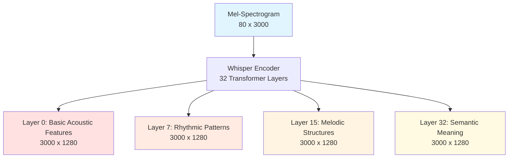
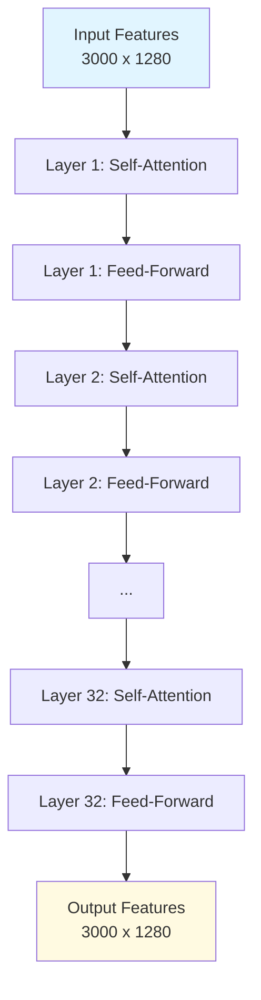
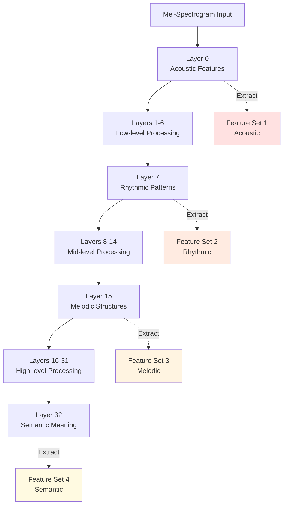
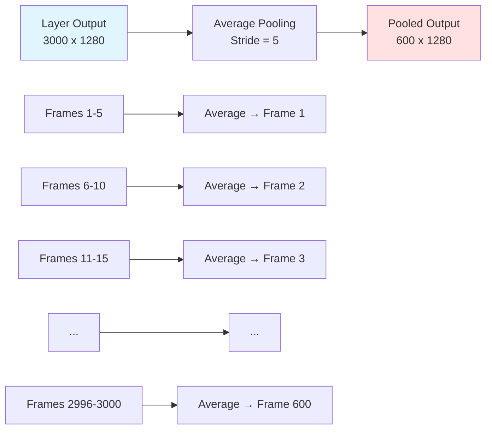
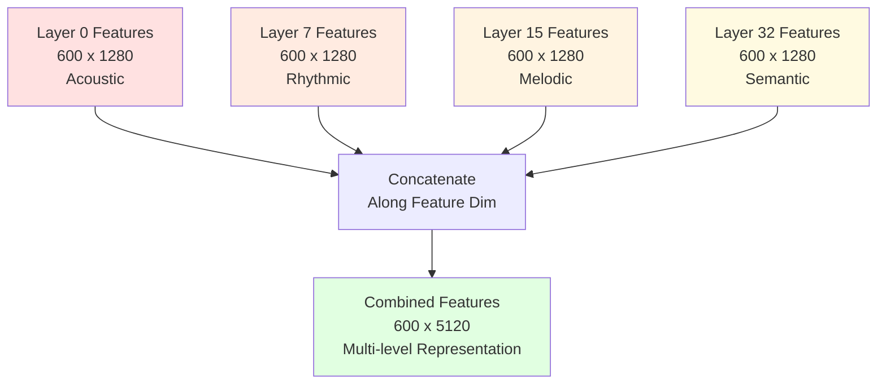
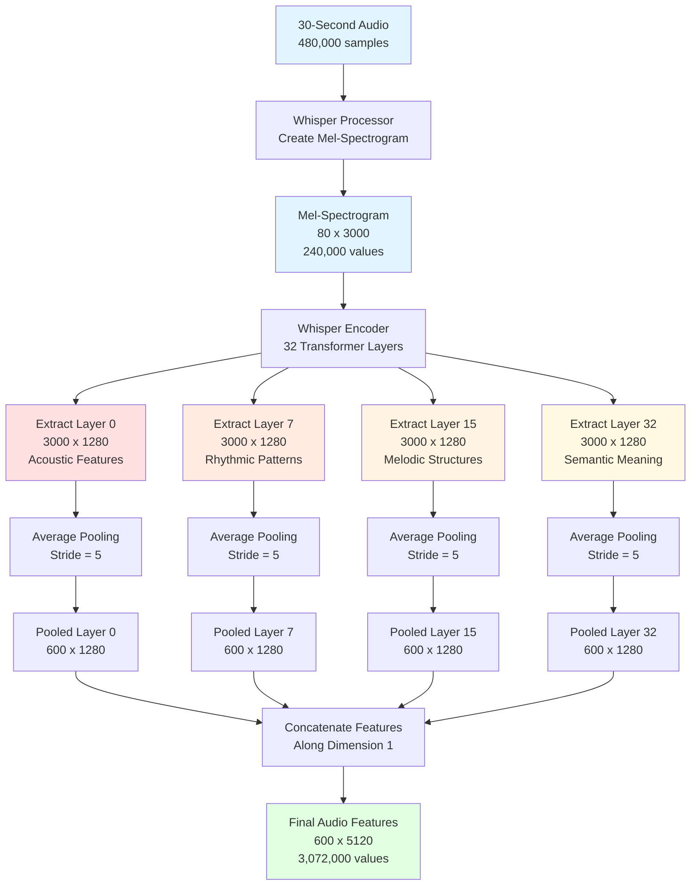

# Whisper Encoder: The Audio Understanding Component

## What is the Whisper Encoder?

Think of the Whisper encoder as a sophisticated **series of filters** that progressively understand audio at deeper and deeper levels. Just like how your brain processes sound - first detecting basic tones, then recognizing rhythms, then understanding melodies, and finally grasping the overall meaning - Whisper does the same thing through its 32 layers of processing.

**Simple Analogy**: Imagine you're listening to a song:
- **Your ears** pick up the raw sound waves (like a microphone)
- **Your auditory cortex** breaks down the sound into frequencies and patterns
- **Your brain's deeper layers** recognize instruments, rhythm, and melody
- **Your highest-level thinking** understands the genre, mood, and meaning

Whisper's encoder mimics this process, transforming raw audio into rich, meaningful representations that capture everything from basic acoustic properties to high-level semantic understanding.

## Architecture Overview

**Model**: Whisper-large-v3

**Key Specifications**:
- **Total Layers**: 32 transformer layers
- **Hidden Dimension**: 1280 (each audio position is represented by 1280 numbers)
- **Input**: Mel-spectrogram with shape [80 mel bins, 3000 time frames]
- **Output**: Sequence of feature vectors with shape [3000, 1280]



## Input: Mel-Spectrogram

Before we dive into the encoder, let's understand what it receives as input.

**What is a Mel-Spectrogram?**

A mel-spectrogram is a visual representation of audio that shows:
- **Vertical axis**: Frequency (pitch) - divided into 80 "mel bins"
- **Horizontal axis**: Time - divided into frames (3000 frames for 30 seconds)
- **Color/Intensity**: How loud each frequency is at each moment

**Simple Analogy**: Think of it like sheet music, but instead of notes, you have a heatmap showing which frequencies are active at each moment in time.

**Dimensions for 30-second audio**:
```
Input audio: 480,000 samples (30 seconds × 16,000 samples/second)
    ↓
Mel-spectrogram: [80 mel bins, 3000 time frames]
    ↓
Total values: 80 × 3000 = 240,000 numbers
```

**What each dimension means**:
- **80 mel bins**: Represents 80 different frequency ranges (from low bass to high treble)
- **3000 frames**: Represents 3000 time steps (one frame every 10 milliseconds)

## The 32-Layer Transformer Architecture


**What is a Transformer Layer?**

Each transformer layer performs two main operations:
1. **Self-Attention**: Looks at all time frames and decides which ones are related
2. **Feed-Forward Network**: Processes each time frame independently to extract features

**Simple Analogy**: Imagine reading a sentence:
- **Self-Attention**: Understanding how words relate to each other ("the cat" - "cat" relates to "the")
- **Feed-Forward**: Understanding what each individual word means

**Layer Structure**:
```
Input: [3000 time frames, 1280 dimensions]
    ↓
Self-Attention: Each frame looks at all other frames
    ↓
Add & Normalize: Combine with input (residual connection)
    ↓
Feed-Forward Network: Process each frame independently
    ↓
Add & Normalize: Combine with previous output
    ↓
Output: [3000 time frames, 1280 dimensions]
```

**All 32 layers repeat this process**, with each layer learning progressively more complex patterns.



## Multi-Layer Feature Extraction Strategy

Here's where MuFun gets clever! Instead of using only the final layer (layer 32), it extracts features from **4 different layers**: 0, 7, 15, and 32.

**Why multiple layers?**

Different layers capture different aspects of the audio, just like how different parts of your brain process sound at different levels of abstraction.

### Layer 0: Basic Acoustic Features

**What it captures**: Raw acoustic properties
- Individual frequencies and their intensities
- Basic timbre (tone quality)
- Fundamental pitch information
- Onset detection (when sounds start)

**Simple Analogy**: Like identifying individual ingredients in a dish - "I hear a guitar string vibrating at 440 Hz"

**Example**: For a guitar note:
- Detects the fundamental frequency (e.g., 440 Hz for A4)
- Captures the harmonic overtones that give guitar its unique sound
- Identifies the attack (pluck) and decay of the note

### Layer 7: Rhythmic Patterns

**What it captures**: Temporal patterns and rhythm
- Beat detection and tempo
- Rhythmic groupings (measures, phrases)
- Percussion patterns
- Timing relationships between sounds

**Simple Analogy**: Like recognizing the beat in a song - "This has a 4/4 time signature with a steady kick drum"

**Example**: For a drum pattern:
- Identifies the regular kick-snare-kick-snare pattern
- Detects the tempo (e.g., 120 BPM)
- Recognizes syncopation and rhythmic variations

### Layer 15: Melodic Structures

**What it captures**: Musical patterns and harmony
- Melodic contours (how pitch changes over time)
- Chord progressions
- Harmonic relationships
- Musical phrases and motifs

**Simple Analogy**: Like humming the melody - "This follows a I-IV-V-I chord progression"

**Example**: For a blues progression:
- Recognizes the 12-bar blues structure
- Identifies the characteristic blue notes
- Captures the call-and-response pattern

### Layer 32: Semantic Meaning

**What it captures**: High-level understanding
- Genre classification (blues, jazz, rock)
- Emotional content (happy, sad, energetic)
- Instrumentation (guitar, piano, vocals)
- Overall musical style and context

**Simple Analogy**: Like describing the song to a friend - "This is a melancholic blues ballad with soulful guitar"

**Example**: For a complete song:
- Identifies it as blues genre
- Recognizes the melancholic mood
- Understands the slow tempo and expressive style
- Captures the overall "feeling" of the music



## Pooling Operation: Reducing Sequence Length

After extracting features from each layer, we have sequences of 3000 time frames. That's a lot of data! To make it more manageable, we apply **average pooling** with a stride of 5.

**What is Pooling?**

Pooling combines multiple consecutive frames into a single frame by averaging them.

**Simple Analogy**: Imagine you have 3000 photos of a moving car. Instead of keeping all 3000, you combine every 5 consecutive photos into one summary photo. You end up with 600 photos that still capture the car's movement but take up less space.

**Mathematical Operation**:
```
Input: [3000 time frames, 1280 dimensions]
Pooling: Average every 5 consecutive frames
Output: [600 time frames, 1280 dimensions]

Formula: output_length = input_length / stride = 3000 / 5 = 600
```

**Visual Representation**:
```
Before Pooling (3000 frames):
Frame:  [1] [2] [3] [4] [5] [6] [7] [8] [9] [10] ... [3000]
        └─────────┘     └─────────┘     └──────────┘
           Average         Average          Average

After Pooling (600 frames):
Frame:  [1]             [2]              [3]        ... [600]
```

**Concrete Example**:

Let's say we have 5 consecutive frames with values for one dimension:
```
Frame 1: 0.8
Frame 2: 0.9
Frame 3: 0.7
Frame 4: 0.8
Frame 5: 0.6

Average: (0.8 + 0.9 + 0.7 + 0.8 + 0.6) / 5 = 0.76

Pooled Frame: 0.76
```

This happens for all 1280 dimensions simultaneously!

**Why Pooling?**
- **Reduces computational cost**: 600 tokens instead of 3000
- **Captures essential information**: Averaging preserves important patterns
- **Removes redundancy**: Adjacent frames are very similar, so averaging doesn't lose much
- **Makes sequences manageable**: 600 tokens fit better in the LLM's context window



## Feature Concatenation: Combining Multiple Layers

Now comes the magic! We take the pooled features from all 4 layers and **concatenate** them along the feature dimension.

**What is Concatenation?**

Concatenation means stacking vectors side-by-side to create a longer vector.

**Simple Analogy**: Imagine you have 4 different descriptions of a song:
1. "Acoustic: Guitar at 440 Hz, drums at 2 Hz"
2. "Rhythmic: 4/4 time, 120 BPM"
3. "Melodic: Blues scale, I-IV-V progression"
4. "Semantic: Melancholic blues ballad"

Concatenation combines all 4 descriptions into one comprehensive description.

**Mathematical Operation**:
```
Layer 0 output:  [600, 1280]
Layer 7 output:  [600, 1280]
Layer 15 output: [600, 1280]
Layer 32 output: [600, 1280]
                      ↓
        Concatenate along dimension 1
                      ↓
Combined output: [600, 5120]

Where: 5120 = 1280 + 1280 + 1280 + 1280 = 1280 × 4
```

**Visual Representation**:

For a single time frame (frame 1):
```
Layer 0:  [0.2, 0.5, 0.8, ..., 0.3]  ← 1280 numbers
Layer 7:  [0.1, 0.7, 0.4, ..., 0.9]  ← 1280 numbers
Layer 15: [0.6, 0.3, 0.2, ..., 0.5]  ← 1280 numbers
Layer 32: [0.4, 0.8, 0.1, ..., 0.7]  ← 1280 numbers
                    ↓
Concatenated: [0.2, 0.5, ..., 0.3, 0.1, 0.7, ..., 0.9, 0.6, 0.3, ..., 0.5, 0.4, 0.8, ..., 0.7]
              └─────────────────┘  └─────────────────┘  └─────────────────┘  └─────────────────┘
                  Layer 0              Layer 7              Layer 15             Layer 32
              ← 5120 numbers total →
```

**Why Concatenate?**
- **Preserves all information**: We don't lose any features from any layer
- **Multi-level representation**: The LLM gets acoustic, rhythmic, melodic, AND semantic info
- **Richer understanding**: Like having multiple experts describe the same audio



## Complete Whisper Processing Flow

Let's put it all together with a comprehensive diagram showing the entire Whisper encoder pipeline:



## Concrete Numerical Example

Let's trace through a complete example with actual numbers for a 30-second blues guitar solo:

### Step 1: Input Audio
```
Duration: 30 seconds
Sample rate: 16,000 Hz
Total samples: 30 × 16,000 = 480,000 samples
```

### Step 2: Mel-Spectrogram Creation
```
Input: 480,000 audio samples
Process: Short-Time Fourier Transform (STFT) + Mel scaling
Output: [80 mel bins, 3000 time frames]
Total values: 80 × 3000 = 240,000 numbers

Time resolution: 30 seconds / 3000 frames = 10 milliseconds per frame
Frequency resolution: 80 mel bins covering ~20 Hz to 8000 Hz
```

### Step 3: Whisper Encoder Processing
```
Input: [80, 3000] mel-spectrogram
Process: 32 transformer layers
Each layer output: [3000, 1280]

Layer 0 learns:
- Guitar string vibrations at specific frequencies
- Pick attack transients
- Harmonic overtones

Layer 7 learns:
- Note timing and rhythm
- Phrase boundaries
- Tempo variations

Layer 15 learns:
- Melodic patterns (blues scale)
- Pitch bends and vibrato
- Musical phrases

Layer 32 learns:
- Blues genre characteristics
- Expressive, melancholic style
- Guitar solo context
```

### Step 4: Feature Extraction
```
Extract 4 specific layers:
- Layer 0:  [3000, 1280] = 3,840,000 values
- Layer 7:  [3000, 1280] = 3,840,000 values
- Layer 15: [3000, 1280] = 3,840,000 values
- Layer 32: [3000, 1280] = 3,840,000 values

Total extracted: 15,360,000 values
```

### Step 5: Average Pooling
```
For each layer:
Input: [3000, 1280]
Pooling: Stride 5 (average every 5 consecutive frames)
Output: [600, 1280]

Calculation: 3000 / 5 = 600 frames

After pooling all layers:
- Layer 0:  [600, 1280] = 768,000 values
- Layer 7:  [600, 1280] = 768,000 values
- Layer 15: [600, 1280] = 768,000 values
- Layer 32: [600, 1280] = 768,000 values

Total after pooling: 3,072,000 values
```

### Step 6: Feature Concatenation
```
Concatenate along dimension 1:
[600, 1280] + [600, 1280] + [600, 1280] + [600, 1280]
= [600, 5120]

Total values: 600 × 5120 = 3,072,000 values

Each of the 600 audio tokens is now represented by 5120 numbers:
- First 1280 numbers: Acoustic features (Layer 0)
- Next 1280 numbers: Rhythmic features (Layer 7)
- Next 1280 numbers: Melodic features (Layer 15)
- Last 1280 numbers: Semantic features (Layer 32)
```

### Summary Table

| Step | Description | Shape | Total Values |
|------|-------------|-------|--------------|
| 1 | Raw audio | 480,000 samples | 480,000 |
| 2 | Mel-spectrogram | [80, 3000] | 240,000 |
| 3 | Layer 0 output | [3000, 1280] | 3,840,000 |
| 3 | Layer 7 output | [3000, 1280] | 3,840,000 |
| 3 | Layer 15 output | [3000, 1280] | 3,840,000 |
| 3 | Layer 32 output | [3000, 1280] | 3,840,000 |
| 4 | Pooled Layer 0 | [600, 1280] | 768,000 |
| 4 | Pooled Layer 7 | [600, 1280] | 768,000 |
| 4 | Pooled Layer 15 | [600, 1280] | 768,000 |
| 4 | Pooled Layer 32 | [600, 1280] | 768,000 |
| 5 | **Final output** | **[600, 5120]** | **3,072,000** |

## Key Takeaways

1. **Multi-layer extraction captures different aspects**: Acoustic, rhythmic, melodic, and semantic features are all preserved

2. **Pooling reduces redundancy**: 3000 frames → 600 tokens without losing essential information

3. **Concatenation preserves all information**: All 4 layers' features are combined, not averaged or mixed

4. **Rich representation**: Each audio token (representing 50ms of audio) is described by 5120 numbers capturing multiple levels of understanding

5. **Efficient encoding**: 30 seconds of audio → 600 tokens, making it manageable for the LLM to process

This multi-level feature extraction is what makes MuFun so powerful at understanding music - it doesn't just hear the notes, it understands the rhythm, melody, and meaning all at once!

## Next Steps

Now that you understand how Whisper extracts rich audio features, the next document explains how the Connector translates these features into a format the language model can understand.

→ Continue to [03-connector.md](03-connector.md)

---

**Related Documents**:
- [Previous: Audio Preprocessing](01-audio-preprocessing.md)
- [Next: Connector](03-connector.md)
- [Overview](00-overview.md)
