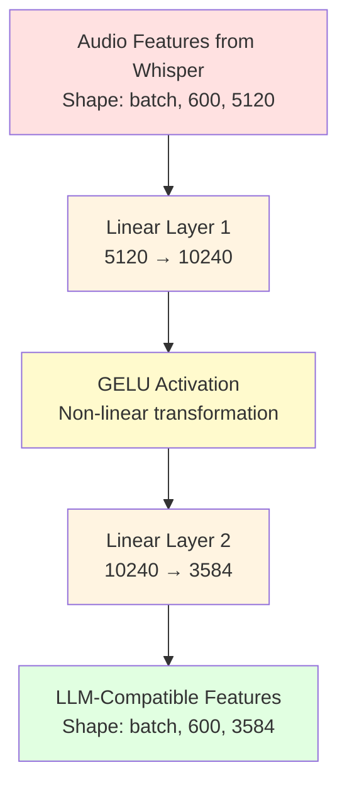
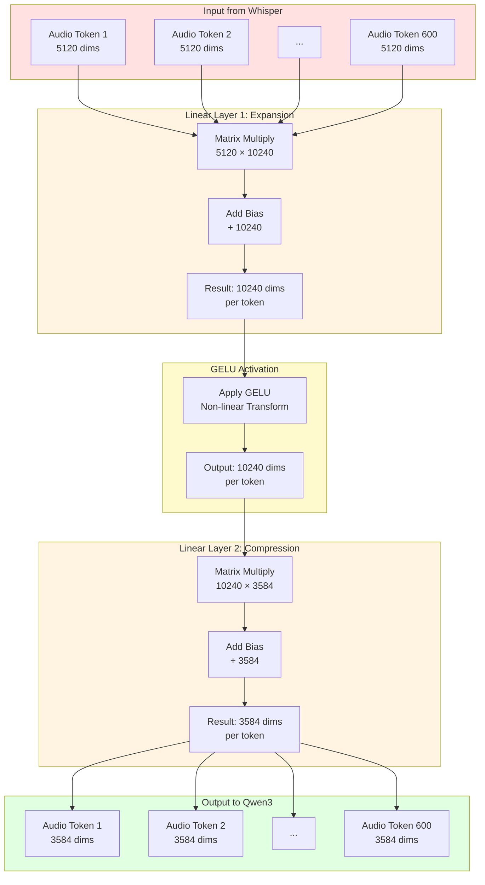

# The Connector: Bridging Audio and Language

## What is the Connector?

The Connector is like a **translator** that sits between two people who speak different languages. In MuFun's case:
- **Whisper** speaks "Audio Language" - it represents sounds as 5120-dimensional vectors
- **Qwen3** speaks "Text Language" - it represents words as 3584-dimensional vectors

The Connector's job is to translate audio features from Whisper's representation space into a format that Qwen3 can understand and process alongside text. Without this translator, the language model wouldn't know how to interpret the audio features!

## Why Do We Need a Connector?

Think of it this way: imagine you have a friend who only understands measurements in meters, and another friend who only understands feet. If you want them to work together on a construction project, you need someone to convert between the two measurement systems.

Similarly:
- Whisper outputs features with **5120 dimensions** (because we concatenate 4 layers × 1280 dimensions each)
- Qwen3 expects inputs with **3584 dimensions** (its embedding size)
- The Connector transforms 5120 → 3584 so they can work together

## The BLP Architecture

MuFun uses a connector called **BLP_4i_2x**. Let's decode this name:

- **BLP**: Bi-Linear Projection (two linear layers)
- **4i**: Input dimension multiplier (4 Whisper layers concatenated: 4 × 1280 = 5120)
- **2x**: Hidden dimension multiplier (the middle layer is 2× the input size)

### Architecture Overview




## Layer-by-Layer Breakdown

### Layer 1: Expansion (5120 → 10240)

**What it does**: Expands the feature space to give the network more capacity to learn complex transformations.

**Mathematical Operation**:
```
Input: X with shape [batch_size, 600, 5120]
Weight matrix: W1 with shape [5120, 10240]
Bias: b1 with shape [10240]

Output: Y1 = X @ W1 + b1
Result shape: [batch_size, 600, 10240]
```

**Concrete Example** (for 1 audio chunk):
```
Input:  [1, 600, 5120]  = 600 tokens × 5120 numbers each = 3,072,000 numbers
Weight: [5120, 10240]   = 52,428,800 parameters
Output: [1, 600, 10240] = 600 tokens × 10240 numbers each = 6,144,000 numbers
```

**Why expand?** 
- Gives the network more "room" to learn complex patterns
- Like giving an artist a bigger canvas to work with
- Allows the network to explore different combinations of audio features

### GELU Activation Function

**What it does**: Adds non-linearity to the transformation, allowing the network to learn complex, non-linear relationships.

**Mathematical Formula**:
```
GELU(x) = x × Φ(x)

Where Φ(x) is the cumulative distribution function of the standard normal distribution
Approximation: GELU(x) ≈ 0.5 × x × (1 + tanh(√(2/π) × (x + 0.044715 × x³)))
```

**Simple Explanation**: 
- Linear layers alone can only learn straight-line relationships
- GELU adds curves and bends to these relationships
- Think of it like adding flexibility to a rigid ruler

**Why GELU instead of ReLU?**
- GELU is smoother (no sharp corners like ReLU)
- Works better for language models
- Provides better gradients during training

**Visual Behavior**:
```
Input:  [-2.0, -1.0, 0.0, 1.0, 2.0]
Output: [-0.05, -0.16, 0.0, 0.84, 1.95]

Notice: 
- Negative values are slightly suppressed (but not zeroed like ReLU)
- Positive values pass through mostly unchanged
- Creates smooth, continuous transformations
```

### Layer 2: Compression (10240 → 3584)

**What it does**: Compresses the expanded features down to the target dimension that Qwen3 expects.

**Mathematical Operation**:
```
Input: Y1 with shape [batch_size, 600, 10240]
Weight matrix: W2 with shape [10240, 3584]
Bias: b2 with shape [3584]

Output: Y2 = Y1 @ W2 + b2
Result shape: [batch_size, 600, 3584]
```

**Concrete Example** (for 1 audio chunk):
```
Input:  [1, 600, 10240] = 600 tokens × 10240 numbers each = 6,144,000 numbers
Weight: [10240, 3584]   = 36,700,160 parameters
Output: [1, 600, 3584]  = 600 tokens × 3584 numbers each = 2,150,400 numbers
```

**Why compress?**
- Forces the network to extract only the most important information
- Creates a "bottleneck" that learns efficient representations
- Matches Qwen3's expected input dimension (3584)


## The Expansion-Compression Design Pattern

This two-layer design with expansion followed by compression is called a **bottleneck architecture**. It's a common pattern in deep learning.

### Why This Pattern Works

**Analogy**: Think of it like summarizing a book:
1. **Expansion**: First, you read the entire book and take detailed notes (expanding your understanding)
2. **Compression**: Then, you distill those notes into a concise summary (compressing to key points)

**In the Connector**:
1. **Expansion (5120 → 10240)**: 
   - Explores many possible combinations of audio features
   - Learns complex relationships between different aspects of the audio
   - Creates a rich, high-dimensional representation

2. **Compression (10240 → 3584)**:
   - Extracts the most important information
   - Removes redundancy
   - Creates a compact representation that the LLM can efficiently process

### Benefits of This Design

1. **Increased Learning Capacity**: The expansion gives the network more parameters to learn complex transformations
2. **Feature Selection**: The compression forces the network to identify what's truly important
3. **Dimensionality Matching**: The final output matches Qwen3's embedding dimension exactly
4. **Efficient Representation**: The bottleneck creates a compact but information-rich representation

### Alternative Designs (Not Used)

**Direct Projection (5120 → 3584)**:
```
Single linear layer: [5120, 3584] = 18,350,080 parameters
```
- Simpler but less expressive
- Fewer parameters to learn complex transformations
- MuFun chose the bottleneck design for better performance

**Deeper Network (3+ layers)**:
```
5120 → 10240 → 7168 → 3584
```
- More complex but slower
- Risk of overfitting
- Diminishing returns for this task

## Complete Mathematical Flow

Let's trace the complete transformation with actual numbers:

### Step-by-Step Calculation

**Starting Point**: 600 audio tokens from Whisper (30 seconds of audio)

```
Step 0: Input from Whisper
Shape: [1, 600, 5120]
Total numbers: 1 × 600 × 5120 = 3,072,000

Step 1: First Linear Transformation
Operation: X @ W1 + b1
Input shape:  [1, 600, 5120]
Weight shape: [5120, 10240]
Output shape: [1, 600, 10240]
Total numbers: 1 × 600 × 10240 = 6,144,000

Step 2: GELU Activation
Operation: GELU(Y1)
Input shape:  [1, 600, 10240]
Output shape: [1, 600, 10240]
(Shape unchanged, values transformed non-linearly)

Step 3: Second Linear Transformation
Operation: Y1_activated @ W2 + b2
Input shape:  [1, 600, 10240]
Weight shape: [10240, 3584]
Output shape: [1, 600, 3584]
Total numbers: 1 × 600 × 3584 = 2,150,400
```

### Dimension Tracking Table

| Stage | Shape | Total Numbers | Description |
|-------|-------|---------------|-------------|
| Input | [1, 600, 5120] | 3,072,000 | Audio features from Whisper |
| After Linear 1 | [1, 600, 10240] | 6,144,000 | Expanded representation |
| After GELU | [1, 600, 10240] | 6,144,000 | Non-linear activation |
| After Linear 2 | [1, 600, 3584] | 2,150,400 | LLM-compatible embeddings |


## Worked Example: Processing 600 Audio Tokens

Let's walk through a complete example with a 30-second audio chunk that has been processed by Whisper.

### Initial State

You have a 30-second audio clip that Whisper has processed:
- **Input**: 480,000 audio samples (30 seconds × 16,000 samples/second)
- **After Whisper**: 600 audio tokens, each with 5120 features
- **Shape**: [1, 600, 5120]

### Connector Processing

**Step 1: First Linear Layer**

```python
# Input
audio_features = torch.randn(1, 600, 5120)  # From Whisper

# Weight matrix (learned during training)
W1 = torch.randn(5120, 10240)
b1 = torch.randn(10240)

# Matrix multiplication
# [1, 600, 5120] @ [5120, 10240] = [1, 600, 10240]
expanded = audio_features @ W1 + b1

print(f"Input shape: {audio_features.shape}")
# Output: Input shape: torch.Size([1, 600, 5120])

print(f"After expansion: {expanded.shape}")
# Output: After expansion: torch.Size([1, 600, 10240])
```

**What happened?**
- Each of the 600 tokens went from 5120 numbers to 10240 numbers
- The network learned to combine the 5120 input features in 10240 different ways
- This creates a richer representation with more capacity

**Step 2: GELU Activation**

```python
import torch.nn.functional as F

# Apply GELU activation
activated = F.gelu(expanded)

print(f"After GELU: {activated.shape}")
# Output: After GELU: torch.Size([1, 600, 10240])

# Example values before and after GELU
print(f"Before GELU: {expanded[0, 0, :5]}")
# Output: Before GELU: tensor([-1.2, 0.5, 2.1, -0.3, 1.8])

print(f"After GELU: {activated[0, 0, :5]}")
# Output: After GELU: tensor([-0.14, 0.35, 2.09, -0.11, 1.78])
```

**What happened?**
- Negative values are suppressed (but not zeroed)
- Positive values mostly pass through
- Adds non-linearity to enable complex transformations

**Step 3: Second Linear Layer**

```python
# Weight matrix (learned during training)
W2 = torch.randn(10240, 3584)
b2 = torch.randn(3584)

# Matrix multiplication
# [1, 600, 10240] @ [10240, 3584] = [1, 600, 3584]
output = activated @ W2 + b2

print(f"Final output shape: {output.shape}")
# Output: Final output shape: torch.Size([1, 600, 3584])
```

**What happened?**
- Each of the 600 tokens went from 10240 numbers to 3584 numbers
- The network learned to extract the most important information
- Output dimension (3584) matches Qwen3's embedding dimension

### Final Result

```
Input:  600 audio tokens × 5120 dimensions = 3,072,000 numbers
Output: 600 audio tokens × 3584 dimensions = 2,150,400 numbers

Each audio token is now in the same 3584-dimensional space as text tokens!
```

### Visualization of Token Transformation

```
Token 1:  [0.23, -0.45, 0.67, ..., 0.12]  (5120 numbers)
            ↓ Linear 1 + GELU
          [0.45, 0.23, -0.12, ..., 0.89, 0.34, ...]  (10240 numbers)
            ↓ Linear 2
          [0.12, -0.34, 0.56, ..., 0.78]  (3584 numbers)

Token 2:  [0.34, 0.12, -0.23, ..., 0.45]  (5120 numbers)
            ↓ Linear 1 + GELU
          [0.67, -0.12, 0.34, ..., 0.23, 0.56, ...]  (10240 numbers)
            ↓ Linear 2
          [0.23, 0.45, -0.12, ..., 0.34]  (3584 numbers)

... (598 more tokens)
```


## Detailed Projection Flow Diagram

Here's a comprehensive diagram showing how data flows through the connector:



## Parameter Count

The Connector has a relatively small number of parameters compared to Whisper and Qwen3:

```
Linear Layer 1:
  Weights: 5120 × 10240 = 52,428,800 parameters
  Bias:    10240 parameters
  Total:   52,439,040 parameters

Linear Layer 2:
  Weights: 10240 × 3584 = 36,700,160 parameters
  Bias:    3584 parameters
  Total:   36,703,744 parameters

Total Connector Parameters: 89,142,784 (~89M parameters)
```

**In Context**:
- Whisper-large-v3: ~1.5 billion parameters
- Connector: ~89 million parameters (~6% of Whisper)
- Qwen3-8B: ~8 billion parameters
- **Total MuFun**: ~9.6 billion parameters

The Connector is relatively lightweight but plays a crucial role in enabling multimodal understanding!

## Memory Requirements

**Storage** (BF16 precision):
```
89,142,784 parameters × 2 bytes/parameter = 178,285,568 bytes
≈ 170 MB
```

**During Forward Pass** (batch size = 1):
```
Input:  3,072,000 numbers × 2 bytes = 6.14 MB
Layer 1: 6,144,000 numbers × 2 bytes = 12.29 MB
Layer 2: 2,150,400 numbers × 2 bytes = 4.30 MB

Total activation memory: ~23 MB per audio chunk
```

The Connector is very memory-efficient!


## Training the Connector

The Connector is trained in two stages:

### Stage 1: Warmup (Connector Only)

**What happens**:
- Whisper encoder: **Frozen** (weights don't change)
- Connector: **Training** (weights are updated)
- Qwen3 LLM: **Frozen** (weights don't change)

**Why**:
- The Connector starts with random weights
- It needs to learn the basic translation between audio and text spaces
- Training only the Connector is faster and prevents disrupting the pre-trained models

**Duration**: A few epochs (typically 1-3)

### Stage 2: Full Fine-tuning

**What happens**:
- Whisper encoder: **Training** (fine-tuned for music)
- Connector: **Training** (continues learning)
- Qwen3 LLM: **Training** (fine-tuned for music understanding)

**Why**:
- Now that the Connector has learned basic translation, all components can be fine-tuned together
- This allows the entire system to adapt to music understanding tasks
- Each component learns to work better with the others

**Duration**: Multiple epochs (typically 5-10)

## How the Connector Learns

During training, the Connector learns to:

1. **Identify Important Audio Features**: Which of the 5120 input dimensions are most relevant?
2. **Combine Features**: How should different audio features be combined?
3. **Map to Text Space**: How do audio patterns relate to text concepts?
4. **Preserve Information**: What information must be kept for the LLM to understand?

**Example Learning**:
- Input: Audio features representing a "blues guitar riff"
- Connector learns to map this to embeddings similar to the text tokens "blues" and "guitar"
- This allows the LLM to understand the audio in terms of musical concepts

## Key Takeaways

1. **The Connector is a Translator**: It converts audio features (5120 dims) to LLM embeddings (3584 dims)

2. **Expansion-Compression Pattern**: 
   - Expand (5120 → 10240) for learning capacity
   - Compress (10240 → 3584) for efficient representation

3. **GELU Activation**: Adds non-linearity for complex transformations

4. **Lightweight but Crucial**: Only ~89M parameters but essential for multimodal fusion

5. **Two-Stage Training**: Warmup (connector only) then full fine-tuning (all components)

6. **Dimension Matching**: Ensures audio tokens have the same dimension as text tokens (3584)

## What's Next?

Now that audio features have been translated into the LLM's language, they can be combined with text tokens and processed by Qwen3. The next document will cover:
- How text is tokenized and embedded
- How text and audio embeddings are interleaved
- How Qwen3 processes the combined sequence
- How the model generates text responses

Continue to: [04-qwen3-llm.md](04-qwen3-llm.md)

---

**Related Documents**:
- [Previous: Whisper Encoder](02-whisper-encoder.md)
- [Next: Qwen3 LLM](04-qwen3-llm.md)
- [Overview](00-overview.md)
