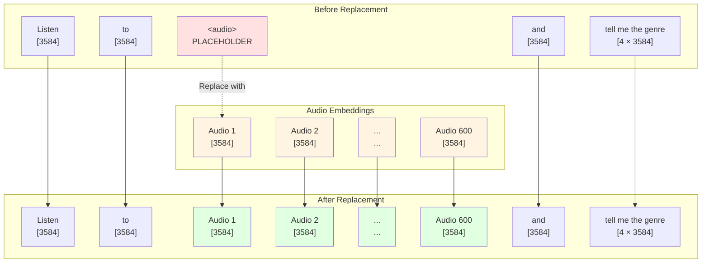
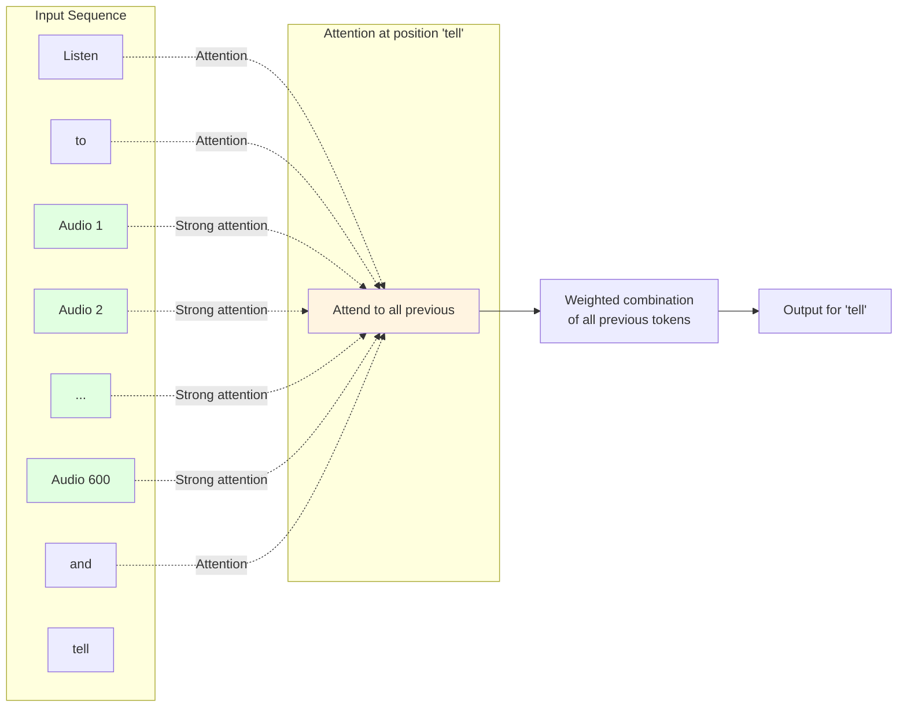

# Qwen3 Language Model Integration

## What is the LLM?

The **Language Model (LLM)** is the "brain" of MuFun. After the audio has been processed by Whisper and translated by the Connector, the LLM's job is to understand both the audio and text together, then generate a coherent response.

Think of it like this:
- **Whisper** = Your ears (hearing the music)
- **Connector** = Your auditory cortex (processing what you heard)
- **Qwen3 LLM** = Your brain (understanding and talking about the music)

The LLM used in MuFun is **Qwen3-8B-Base**, a powerful language model with 8 billion parameters that has been trained on vast amounts of text data. What makes it special for MuFun is that it can process both text and audio embeddings in the same sequence.

## Model Specifications

| Property             | Value               | What it means                                          |
| -------------------- | ------------------- | ------------------------------------------------------ |
| **Model Name**       | Qwen3-8B-Base       | The specific version of Qwen used                      |
| **Parameters**       | 8 billion           | 8 billion trainable weights (numbers the model learns) |
| **Hidden Dimension** | 3584                | Each token is represented by 3584 numbers              |
| **Vocabulary Size**  | ~151,000 tokens     | The model knows about 151,000 different word pieces    |
| **Context Length**   | 4096 tokens         | Can process up to 4096 tokens at once (text + audio)   |
| **Architecture**     | Transformer Decoder | Uses attention mechanism to process sequences          |

**What does this mean in practice?**
- A 3-minute song creates ~3600 audio tokens
- You can add ~400 text tokens for prompts and responses
- Total: 4096 tokens maximum per request

## Text Tokenization

Before the LLM can process text, it needs to convert words into numbers. This process is called **tokenization**.

### How Tokenization Works

**Simple Explanation**: Imagine you have a dictionary with 151,000 entries. Each entry has a word or word piece and a number. Tokenization is looking up each word in your sentence and replacing it with its number.

### Example 1: Basic Tokenization

```
Input text: "What genre is this song?"

Step 1: Split into tokens
["What", " genre", " is", " this", " song", "?"]

Step 2: Convert to token IDs
[3923, 17779, 374, 419, 5609, 30]

Step 3: Convert to embeddings
Each ID → 3584-dimensional vector
3923 → [0.23, -0.45, 0.67, ..., 0.12]  (3584 numbers)
17779 → [-0.12, 0.34, -0.56, ..., 0.89]  (3584 numbers)
... and so on
```

**Important Notes**:
- Spaces are part of tokens (notice " genre" includes the space)
- Common words are single tokens ("is", "this")
- Rare words might be split into multiple tokens
- Punctuation can be separate tokens or attached to words

### Example 2: The Special `<audio>` Token

The `<audio>` token is special - it's a placeholder that tells the model "insert audio embeddings here".

```
Input text: "Listen to <audio> and describe the mood"

Step 1: Tokenize
["Listen", " to", " <audio>", " and", " describe", " the", " mood"]

Step 2: Token IDs
[41825, 284, -200, 323, 7664, 279, 20247]
                ↑
         Special audio token ID

Step 3: Embedding lookup
- "Listen" (41825) → [3584 numbers]
- "to" (284) → [3584 numbers]
- <audio> (-200) → PLACEHOLDER (will be replaced)
- "and" (323) → [3584 numbers]
- ... and so on
```

The token ID `-200` is a special marker. During processing, this single token gets replaced with all the audio embeddings (e.g., 600 tokens for a 30-second clip).

## Audio Token Replacement

This is where the magic happens - combining text and audio into one unified sequence.

### Step-by-Step Replacement Process

Let's trace through a complete example:

**Input**: `"Listen to <audio> and tell me the genre"`

**Step 1: Initial Tokenization**
```
Text tokens: ["Listen", "to", "<audio>", "and", "tell", "me", "the", "genre"]
Token IDs:   [41825,    284,   -200,     323,   3291,  502,  279,   17779]
Sequence length: 8 tokens
```

**Step 2: Text Embedding**
```
Each token ID is converted to a 3584-dimensional embedding:

Position 0: "Listen" → [0.23, -0.45, ..., 0.12]  (3584 numbers)
Position 1: "to"     → [-0.12, 0.34, ..., 0.89]  (3584 numbers)
Position 2: <audio>  → PLACEHOLDER
Position 3: "and"    → [0.45, -0.23, ..., 0.67]  (3584 numbers)
Position 4: "tell"   → [-0.34, 0.56, ..., -0.45] (3584 numbers)
Position 5: "me"     → [0.67, -0.12, ..., 0.23]  (3584 numbers)
Position 6: "the"    → [-0.89, 0.45, ..., -0.34] (3584 numbers)
Position 7: "genre"  → [0.12, -0.67, ..., 0.56]  (3584 numbers)

Shape: [8, 3584]
```

**Step 3: Audio Embeddings from Connector**
```
From the Connector, we have 600 audio embeddings (for 30 seconds of audio):

Audio embedding 1:   [0.34, -0.56, ..., 0.78]  (3584 numbers)
Audio embedding 2:   [-0.23, 0.67, ..., -0.12] (3584 numbers)
...
Audio embedding 600: [0.45, -0.34, ..., 0.89]  (3584 numbers)

Shape: [600, 3584]
```

**Step 4: Replace `<audio>` Token**
```
The placeholder at position 2 is replaced with all 600 audio embeddings:

Position 0:   "Listen" embedding
Position 1:   "to" embedding
Position 2:   Audio embedding 1    ← Start of audio
Position 3:   Audio embedding 2
Position 4:   Audio embedding 3
...
Position 601: Audio embedding 600  ← End of audio
Position 602: "and" embedding
Position 603: "tell" embedding
Position 604: "me" embedding
Position 605: "the" embedding
Position 606: "genre" embedding

Final shape: [607, 3584]
Total tokens: 2 (before audio) + 600 (audio) + 5 (after audio) = 607
```

### Visual Diagram of Replacement



### Multiple Audio Files

MuFun can handle multiple audio files in a single prompt:

```
Input: "Compare <audio> and <audio>"

After replacement:
["Compare", audio_1_emb_1, ..., audio_1_emb_600, "and", 
 audio_2_emb_1, ..., audio_2_emb_600]

Total: 1 + 600 + 1 + 600 = 1202 tokens
```

## Embedding Interleaving

**Interleaving** means mixing text and audio embeddings in the same sequence. This is what makes MuFun multimodal.

### Why Interleaving Works

Both text and audio embeddings live in the same 3584-dimensional space. To the LLM, they're just vectors - it doesn't "know" which ones came from text and which from audio. This allows the model to:

1. **Attend to audio when generating text about music**
2. **Use text context to interpret audio**
3. **Generate responses that reference both modalities**

### Concrete Example with Color Coding

Let's use colors to show text vs audio:

```
🔵 = Text embedding
🟢 = Audio embedding

Input sequence after interleaving:
[🔵 🔵 🟢 🟢 🟢 ... 🟢 🔵 🔵 🔵 🔵 🔵]
 ↑  ↑  ↑              ↑  ↑  ↑  ↑  ↑  ↑
 L  i  Audio         a  n  d  t  e  l
 i  s  embeddings    n  d     e  l  l
 s  t  (600 total)   d        l  l
 t  e                                
 e  n                                
 n                                   

All embeddings: [607, 3584]
```

### Mathematical Representation

```python
# Text before audio
text_before = embed_text(["Listen", "to"])  # Shape: [2, 3584]

# Audio embeddings
audio_embs = connector_output  # Shape: [600, 3584]

# Text after audio
text_after = embed_text(["and", "tell", "me", "the", "genre"])  # Shape: [5, 3584]

# Concatenate along sequence dimension
combined = concatenate([text_before, audio_embs, text_after], axis=0)
# Final shape: [607, 3584]
```

## Causal Attention

**Causal attention** is the mechanism that allows the LLM to process the sequence and generate responses.

### What is Attention?

**Simple Explanation**: Attention is how the model decides which parts of the input are important for understanding each position.

Think of it like reading a sentence:
- When you read the word "it", you look back to see what "it" refers to
- When you read "blues song", you might think back to the audio you heard
- Attention does this automatically for every word

### Causal Constraint

"Causal" means the model can only look at previous tokens, not future ones. This is crucial for text generation.

**Why?** When generating text left-to-right, you can't peek ahead at words you haven't written yet!

### Attention Visualization

```
Generating the response: "This is a blues song"

Position 607 (generating "This"):
Can attend to: [Listen, to, audio_1, ..., audio_600, and, tell, me, the, genre]
Cannot attend to: [is, a, blues, song] (not generated yet)

Position 608 (generating "is"):
Can attend to: [Listen, to, audio_1, ..., audio_600, and, tell, me, the, genre, This]
Cannot attend to: [a, blues, song]

Position 609 (generating "a"):
Can attend to: [Listen, to, audio_1, ..., audio_600, and, tell, me, the, genre, This, is]
Cannot attend to: [blues, song]
```

### Attention Matrix

For a sequence of length N, the attention matrix is N × N, but only the lower triangle is used:

```
        L  i  s  t  e  n  [audio...]  a  n  d  ...
Listen  ✓  ✗  ✗  ✗  ✗  ✗     ✗       ✗  ✗  ✗  ...
to      ✓  ✓  ✗  ✗  ✗  ✗     ✗       ✗  ✗  ✗  ...
audio1  ✓  ✓  ✓  ✗  ✗  ✗     ✗       ✗  ✗  ✗  ...
audio2  ✓  ✓  ✓  ✓  ✗  ✗     ✗       ✗  ✗  ✗  ...
...
and     ✓  ✓  ✓  ✓  ✓  ✓     ✓       ✗  ✗  ✗  ...
tell    ✓  ✓  ✓  ✓  ✓  ✓     ✓       ✓  ✗  ✗  ...

✓ = Can attend (look at)
✗ = Cannot attend (masked out)
```

### Attention Diagram



## Text Generation Process

Now let's see how the LLM actually generates a response, step by step.

### Generation Overview

1. **Process input sequence** (text + audio)
2. **Compute output logits** (probabilities for next token)
3. **Sample next token** (choose most likely or sample from distribution)
4. **Append to sequence** and repeat until done

### Step-by-Step Generation Example

Let's generate a response to: `"Listen to <audio> and tell me the genre"`

**Initial State**:
```
Input sequence: [Listen, to, audio_1, ..., audio_600, and, tell, me, the, genre]
Length: 607 tokens
```

**Generation Step 1: Predict First Word**

```
1. Forward pass through Qwen3
   Input: [607, 3584] embeddings
   Output: [607, 151000] logits (probability scores for each vocabulary token)

2. Look at the last position (607)
   Logits at position 607: [0.001, 0.002, ..., 0.85, ..., 0.001]
   
3. Find highest probability
   Token ID 1986 ("This") has probability 0.85 (highest)
   
4. Append to sequence
   New sequence: [Listen, to, audio_1, ..., audio_600, and, tell, me, the, genre, This]
   Length: 608 tokens
```

**Generation Step 2: Predict Second Word**

```
1. Forward pass with updated sequence
   Input: [608, 3584] embeddings
   Output: [608, 151000] logits

2. Look at the last position (608)
   Logits at position 608: [0.002, 0.003, ..., 0.92, ..., 0.001]
   
3. Find highest probability
   Token ID 374 ("is") has probability 0.92
   
4. Append to sequence
   New sequence: [..., genre, This, is]
   Length: 609 tokens
```

**Generation Step 3: Predict Third Word**

```
1. Forward pass
   Input: [609, 3584]
   Output: [609, 151000]

2. Last position logits
   Token ID 264 ("a") has highest probability
   
3. Append
   New sequence: [..., genre, This, is, a]
   Length: 610 tokens
```

**Continue until end token...**

```
Step 4: "blues" (token ID 50181)
Step 5: "song" (token ID 5609)
Step 6: "with" (token ID 448)
Step 7: "a" (token ID 264)
Step 8: "slow" (token ID 6435)
Step 9: "tempo" (token ID 28691)
Step 10: "." (token ID 13)
Step 11: <|im_end|> (end token, stop generation)
```

**Final Output**: `"This is a blues song with a slow tempo."`

### Generation Diagram

```mermaid
graph TD
    A[Input: Listen to audio and tell me the genre<br/>607 tokens] --> B[Qwen3 Forward Pass<br/>Process all 607 tokens]
    B --> C[Output Logits<br/>[607, 151000]]
    C --> D[Sample Token at Position 607<br/>Highest: This]
    D --> E[Append This<br/>608 tokens total]
    
    E --> F[Qwen3 Forward Pass<br/>Process all 608 tokens]
    F --> G[Output Logits<br/>[608, 151000]]
    G --> H[Sample Token at Position 608<br/>Highest: is]
    H --> I[Append is<br/>609 tokens total]
    
    I --> J[Continue...]
    J --> K[Final: This is a blues song with a slow tempo.]
    
    style A fill:#e1f5ff
    style D fill:#ffe1e1
    style H fill:#ffe1e1
    style K fill:#f0e1ff
```

### Sampling Strategies

The model doesn't always pick the highest probability token. Different strategies:

1. **Greedy Decoding**: Always pick highest probability
   - Deterministic (same output every time)
   - Can be repetitive

2. **Top-k Sampling**: Sample from top k most likely tokens
   - More diverse outputs
   - k=50 is common

3. **Top-p (Nucleus) Sampling**: Sample from smallest set with cumulative probability > p
   - Adaptive (more choices for uncertain positions)
   - p=0.9 is common

4. **Temperature Scaling**: Adjust probability distribution
   - Temperature < 1: More confident (peaked distribution)
   - Temperature > 1: More random (flatter distribution)
   - Temperature = 1: Use raw probabilities

**Example with temperature**:
```
Raw logits: [2.0, 1.5, 1.0, 0.5]

Temperature = 0.5 (more confident):
Probabilities: [0.52, 0.28, 0.15, 0.05]  ← Peaked

Temperature = 1.0 (normal):
Probabilities: [0.42, 0.31, 0.18, 0.09]

Temperature = 2.0 (more random):
Probabilities: [0.35, 0.29, 0.22, 0.14]  ← Flatter
```

## Complete Text-Audio Combination Flow

Let's put it all together with a comprehensive diagram:

```mermaid
graph TB
    subgraph "Input Processing"
        A1[Text: Listen to audio and tell me the genre]
        A2[Audio: 30-second blues song]
    end
    
    subgraph "Text Path"
        B1[Tokenize Text<br/>8 tokens including audio]
        B2[Token IDs<br/>[41825, 284, -200, 323, 3291, 502, 279, 17779]]
        B3[Text Embeddings<br/>[8, 3584]]
        B4[Find audio placeholder<br/>Position 2 has ID -200]
    end
    
    subgraph "Audio Path"
        C1[Audio Processing<br/>Whisper + Connector]
        C2[Audio Embeddings<br/>[600, 3584]]
    end
    
    subgraph "Combination"
        D1[Replace audio at position 2<br/>with 600 audio embeddings]
        D2[Combined Sequence<br/>[607, 3584]]
        D3[Text before: 2 tokens<br/>Audio: 600 tokens<br/>Text after: 5 tokens]
    end
    
    subgraph "LLM Processing"
        E1[Qwen3 Transformer<br/>32 attention layers]
        E2[Causal Attention<br/>Each token attends to previous]
        E3[Output Logits<br/>[607, 151000]]
    end
    
    subgraph "Generation"
        F1[Sample next token<br/>This]
        F2[Append and repeat<br/>This → is → a → blues → song]
        F3[Stop at end token<br/>im_end]
        F4[Final Output<br/>This is a blues song with a slow tempo.]
    end
    
    A1 --> B1
    B1 --> B2
    B2 --> B3
    B3 --> B4
    
    A2 --> C1
    C1 --> C2
    
    B4 --> D1
    C2 --> D1
    D1 --> D2
    D2 --> D3
    
    D3 --> E1
    E1 --> E2
    E2 --> E3
    
    E3 --> F1
    F1 --> F2
    F2 --> F3
    F3 --> F4
    
    style A1 fill:#e1f5ff
    style A2 fill:#e1f5ff
    style C2 fill:#ffe1e1
    style D2 fill:#fff4e1
    style E1 fill:#e1ffe1
    style F4 fill:#f0e1ff
```

## Context Length and Token Budget

Understanding the 4096 token limit is crucial for using MuFun effectively.

### Token Budget Breakdown

```
Maximum context: 4096 tokens

Typical usage:
- System prompt: ~50 tokens
- User question: ~20 tokens
- Audio (3 minutes): ~3600 tokens
- Response: ~400 tokens
- Total: ~4070 tokens ✓ (fits!)

Long audio example:
- System prompt: ~50 tokens
- User question: ~20 tokens
- Audio (5 minutes): ~6000 tokens
- Total: ~6070 tokens ✗ (exceeds limit!)
```

### Audio Duration Limits

```
Audio tokens = (duration_seconds × 16000 samples/sec) / (5 × 16) 
             = duration_seconds × 200 tokens/sec
             = duration_seconds × 10 tokens/sec (after pooling)

Examples:
- 30 seconds: 600 tokens
- 1 minute: 1200 tokens
- 3 minutes: 3600 tokens
- 5 minutes: 6000 tokens (too long!)

Maximum audio duration ≈ 6 minutes (with minimal text)
Practical limit ≈ 3-4 minutes (leaving room for prompts and responses)
```

### Handling Long Audio

For audio longer than 4 minutes, you have options:

1. **Segment-based analysis**: Process specific time ranges
   ```json
   {
       "audio": "long_song.mp3",
       "audio_start": 60.0,
       "audio_end": 120.0
   }
   ```

2. **Chunking**: Process multiple chunks separately
   ```
   Chunk 1: 0-3 minutes → Analysis 1
   Chunk 2: 3-6 minutes → Analysis 2
   Combine analyses
   ```

3. **Summarization**: Use a two-stage approach
   ```
   Stage 1: Analyze each chunk
   Stage 2: Summarize all analyses
   ```

## Key Takeaways

1. **Qwen3 is the "brain"** that understands and generates text based on audio and text inputs

2. **Tokenization converts text to numbers** using a vocabulary of ~151,000 tokens

3. **The `<audio>` token is a placeholder** that gets replaced with audio embeddings from the Connector

4. **Interleaving combines text and audio** in the same 3584-dimensional embedding space

5. **Causal attention** ensures the model only looks at previous tokens when generating

6. **Generation is iterative**: one token at a time, left to right

7. **Context limit is 4096 tokens**: plan your audio duration and prompts accordingly

8. **Audio uses ~10 tokens per second**: a 3-minute song uses ~3600 tokens

## Next Steps

Now that you understand how the LLM processes combined text and audio, you're ready to see the complete end-to-end flow in [05-end-to-end-flow.md](05-end-to-end-flow.md), which traces a full example from audio file to generated response with all the numbers and transformations.

You can also explore practical usage in [07-code-examples.md](07-code-examples.md) to see how to use MuFun in your own projects.

---

**Related Documents**:
- [Previous: Connector](03-connector.md)
- [Next: End-to-End Flow](05-end-to-end-flow.md)
- [Overview](00-overview.md)
