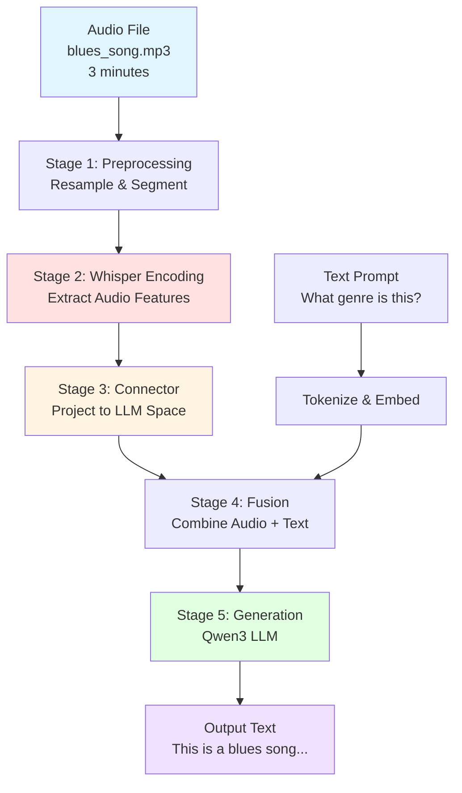
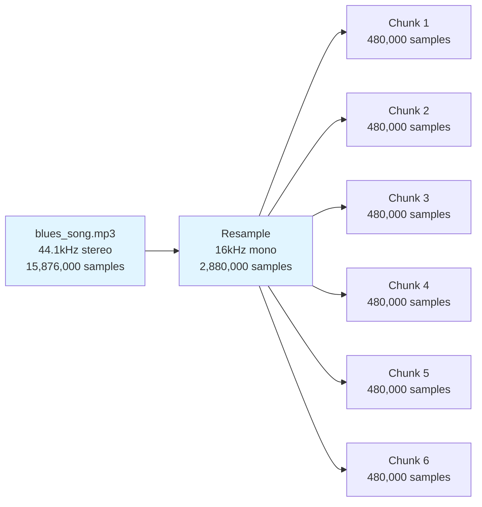
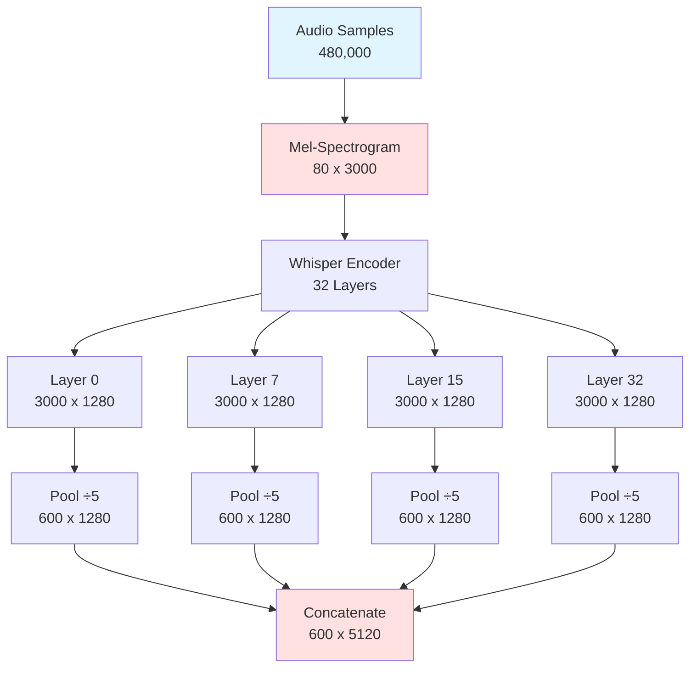
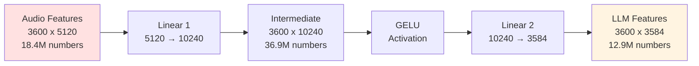
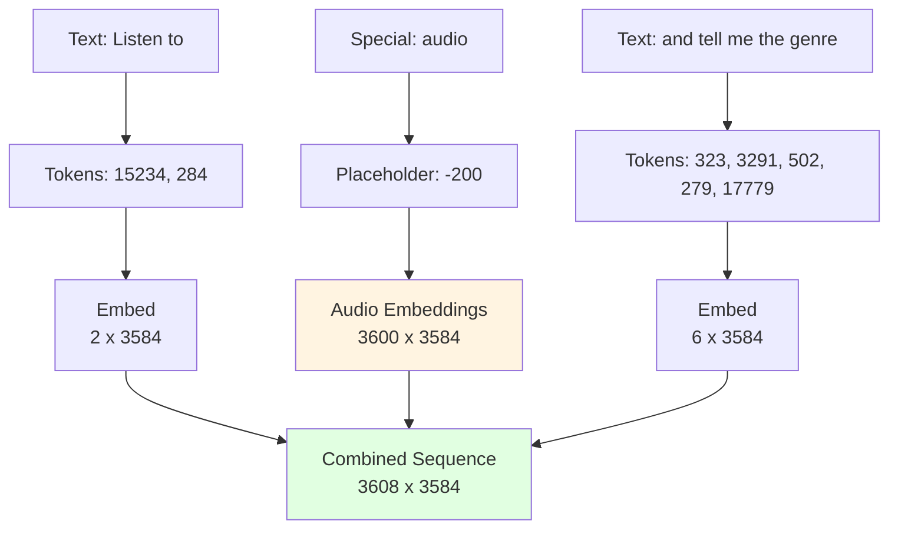
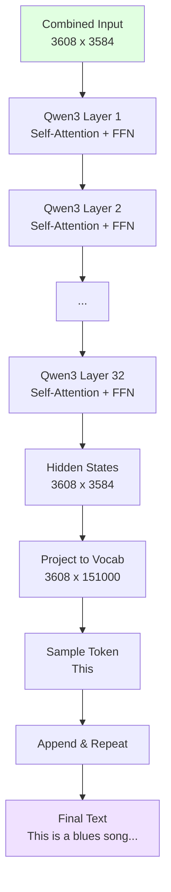
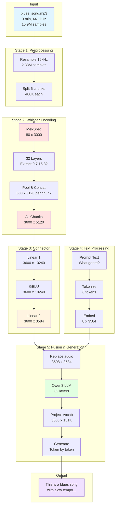

# Complete End-to-End Flow

This document traces the complete journey of audio data through the MuFun system, from a raw audio file to the final generated text output. We'll follow a concrete example with exact numbers at every step.

## Overview

The MuFun pipeline transforms audio into text responses through five major stages:

1. **Audio Preprocessing**: Load and prepare audio data
2. **Audio Encoding**: Extract features using Whisper
3. **Feature Projection**: Map audio features to LLM space
4. **Multimodal Fusion**: Combine audio and text embeddings
5. **Text Generation**: Generate natural language responses



## Worked Example: 3-Minute Blues Song

Let's trace a complete example with concrete numbers at every step.

**Input**:
- Audio file: `blues_song.mp3`
- Duration: 3 minutes (180 seconds)
- Original sample rate: 44.1kHz
- Text prompt: "Listen to <audio> and tell me the genre"

### Stage 1: Audio Preprocessing

**Step 1.1: Load Audio File**

```
Input: blues_song.mp3(3 minutes, 44.1kHz stereo)
Original samples: 180 seconds × 44,100 samples/sec × 2 channels = 15,876,000 samples
```

**Step 1.2: Convert to Mono and Resample to 16kHz**

```
Why 16kHz? Whisper was trained on 16kHz audio
Why mono? Whisper processes single-channel audio

After conversion:
- Sample rate: 16,000 Hz
- Channels: 1 (mono)
- Total samples: 180 seconds × 16,000 samples/sec = 2,880,000 samples
```

**Step 1.3: Segment into 30-Second Chunks**

```
Chunk duration: 30 seconds
Samples per chunk: 30 × 16,000 = 480,000 samples
Number of chunks: 180 ÷ 30 = 6 chunks

Chunk 1: samples 0 to 480,000 (0:00 - 0:30)
Chunk 2: samples 480,000 to 960,000 (0:30 - 1:00)
Chunk 3: samples 960,000 to 1,440,000 (1:00 - 1:30)
Chunk 4: samples 1,440,000 to 1,920,000 (1:30 - 2:00)
Chunk 5: samples 1,920,000 to 2,400,000 (2:00 - 2:30)
Chunk 6: samples 2,400,000 to 2,880,000 (2:30 - 3:00)
```

**Timing**: ~0.5 seconds (I/O and resampling)



### Stage 2: Whisper Audio Encoding

Now we process each chunk through the Whisper encoder. Let's trace Chunk 1 in detail.

**Step 2.1: Convert to Mel-Spectrogram**

```
Input: 480,000 audio samples (waveform)
Process: Whisper's feature extractor applies:
  - Short-Time Fourier Transform (STFT)
  - Mel-scale filterbank (80 mel bins)
  - Log compression

Output: Mel-spectrogram [80 mel bins, 3000 time frames]
```

The mel-spectrogram is a 2D representation:
- **Vertical axis (80)**: Frequency bands (low to high pitch)
- **Horizontal axis (3000)**: Time frames (each ~16ms)

**Step 2.2: Process Through Whisper Encoder**

```
Model: Whisper-large-v3
Architecture: 32 transformer layers
Hidden dimension: 1280

Input: Mel-spectrogram [80, 3000]
Processing: Each of 32 layers transforms the input
Output per layer: [3000 time frames, 1280 features]
```

**Step 2.3: Extract Multi-Layer Features**

Instead of using only the final layer, we extract from 4 different layers:

```
Layer 0 (early):    [3000, 1280] - Basic acoustic features
Layer 7 (early-mid): [3000, 1280] - Rhythmic patterns  
Layer 15 (mid):     [3000, 1280] - Melodic structures
Layer 32 (final):   [3000, 1280] - Semantic meaning

Total: 4 layers × 3000 frames × 1280 features = 15,360,000 numbers
```

**Step 2.4: Apply Pooling (Stride 5)**

To reduce sequence length, we average every 5 consecutive frames:

```
For each layer:
  Input: [3000, 1280]
  Pooling: Average every 5 frames
  Output: [600, 1280]
  
Calculation: 3000 ÷ 5 = 600 tokens

After pooling all 4 layers:
  Layer 0:  [600, 1280]
  Layer 7:  [600, 1280]
  Layer 15: [600, 1280]
  Layer 32: [600, 1280]
```

**Step 2.5: Concatenate Features**

```
Concatenate along the feature dimension:

[600, 1280] + [600, 1280] + [600, 1280] + [600, 1280]
    ↓
[600, 5120]

Each of the 600 audio tokens is now represented by 5120 numbers
Total: 600 × 5120 = 3,072,000 numbers
```

**Timing per chunk**: ~0.3-0.5 seconds on GPU



**For All 6 Chunks**:

```
Each chunk produces: [600, 5120]
Total for 6 chunks: [3600, 5120]

This means our 3-minute song is represented by:
  3600 audio tokens
  Each token: 5120 features
  Total numbers: 18,432,000
```

### Stage 3: Connector Projection

Now we project the audio features into the LLM's embedding space.

**Step 3.1: First Linear Layer (Expansion)**

```
Input: [3600, 5120]
Weight matrix W1: [5120, 10240]
Operation: Matrix multiplication

Output = Input @ W1
Output: [3600, 10240]

This expands the feature dimension from 5120 to 10240
Total numbers: 3600 × 10240 = 36,864,000
```

**Step 3.2: GELU Activation**

```
Input: [3600, 10240]
Operation: Apply GELU non-linearity element-wise
GELU(x) = x × Φ(x) where Φ is the Gaussian CDF

Output: [3600, 10240] (same shape, different values)
```

The GELU activation adds non-linearity, allowing the network to learn complex transformations.

**Step 3.3: Second Linear Layer (Compression)**

```
Input: [3600, 10240]
Weight matrix W2: [10240, 3584]
Operation: Matrix multiplication

Output = Input @ W2
Output: [3600, 3584]

This compresses to Qwen3's hidden dimension (3584)
Total numbers: 3600 × 3584 = 12,902,400
```

**Result**: Our audio is now in the same 3584-dimensional space as text!

**Timing**: ~0.1-0.2 seconds on GPU



### Stage 4: Multimodal Fusion

Now we combine the audio embeddings with text embeddings.

**Step 4.1: Tokenize Text Prompt**

```
Input text: "Listen to <audio> and tell me the genre"

Tokenization:
  "Listen" → token ID 15234
  "to" → token ID 284
  "<audio>" → token ID -200 (special placeholder)
  "and" → token ID 323
  "tell" → token ID 3291
  "me" → token ID 502
  "the" → token ID 279
  "genre" → token ID 17779

Token IDs: [15234, 284, -200, 323, 3291, 502, 279, 17779]
Total: 8 tokens
```

**Step 4.2: Embed Text Tokens**

```
Each token ID is converted to a 3584-dimensional embedding:

"Listen" (15234) → [0.23, -0.45, 0.67, ..., 0.12] (3584 numbers)
"to" (284) → [-0.12, 0.34, -0.56, ..., 0.89] (3584 numbers)
...and so on

Text embeddings shape: [8, 3584]
Total numbers: 8 × 3584 = 28,672
```

**Step 4.3: Replace <audio> Placeholder**

```
Original sequence:
  [Listen_emb, to_emb, <audio>_placeholder, and_emb, tell_emb, me_emb, the_emb, genre_emb]
  Shape: [8, 3584]

Replace <audio> with 3600 audio embeddings:
  [Listen_emb, to_emb, audio_1, audio_2, ..., audio_3600, and_emb, tell_emb, me_emb, the_emb, genre_emb]
  
Final sequence:
  2 text tokens (before audio)
  + 3600 audio tokens
  + 6 text tokens (after audio)
  = 3608 total tokens

Shape: [3608, 3584]
Total numbers: 3608 × 3584 = 12,931,072
```

**Timing**: ~0.01 seconds (very fast)



### Stage 5: Text Generation

Finally, the Qwen3 LLM processes the combined sequence and generates a response.

**Step 5.1: Process Through Qwen3**

```
Input: [3608, 3584] combined embeddings
Model: Qwen3-8B (8 billion parameters)
Architecture: Transformer decoder with causal attention

Processing:
  - Each token attends to all previous tokens
  - 32 transformer layers process the sequence
  - Each layer applies self-attention and feedforward networks

Output: [3608, 3584] hidden states
```

**Step 5.2: Project to Vocabulary**

```
Input: [3608, 3584] hidden states
Weight matrix: [3584, 151000] (vocabulary size)
Operation: Matrix multiplication

Output logits: [3608, 151000]
Each position has 151,000 probabilities (one per vocabulary token)
```

**Step 5.3: Generate Next Token**

```
Focus on position 3608 (after the prompt):
  Logits: [0.001, 0.002, ..., 0.85, ..., 0.001] (151,000 values)
  Apply softmax to get probabilities
  Sample or select highest probability token

First generated token: "This" (ID: 1986)
```

**Step 5.4: Autoregressive Generation**

```
Iteration 1:
  Input: [3608 tokens]
  Generate: "This"
  New sequence: [3609 tokens]

Iteration 2:
  Input: [3609 tokens]
  Generate: "is"
  New sequence: [3610 tokens]

Iteration 3:
  Input: [3610 tokens]
  Generate: "a"
  New sequence: [3611 tokens]

...continue until end token or max length...

Final output: "This is a blues song with a slow tempo and melancholic melody."
```

**Timing**: ~2-5 seconds (depends on response length, ~20-50 tokens/sec)



## Complete Dimension Tracking Table

Here's a comprehensive table showing exact dimensions at every stage:

| Stage | Step | Description | Dimensions | Total Numbers | Memory (BF16) |
|-------|------|-------------|------------|---------------|---------------|
| **Input** | 0 | Raw audio file (3 min, 44.1kHz) | 15,876,000 samples | 15,876,000 | ~30 MB |
| **Preprocessing** | 1.1 | Resample to 16kHz mono | 2,880,000 samples | 2,880,000 | ~5.5 MB |
| | 1.2 | Chunk 1 (30 sec) | 480,000 samples | 480,000 | ~0.9 MB |
| **Whisper** | 2.1 | Mel-spectrogram | [80, 3000] | 240,000 | ~0.5 MB |
| | 2.2 | Layer 0 output | [3000, 1280] | 3,840,000 | ~7.3 MB |
| | 2.3 | Layer 7 output | [3000, 1280] | 3,840,000 | ~7.3 MB |
| | 2.4 | Layer 15 output | [3000, 1280] | 3,840,000 | ~7.3 MB |
| | 2.5 | Layer 32 output | [3000, 1280] | 3,840,000 | ~7.3 MB |
| | 2.6 | After pooling (all layers) | [600, 1280] × 4 | 3,072,000 | ~5.9 MB |
| | 2.7 | After concatenation | [600, 5120] | 3,072,000 | ~5.9 MB |
| | 2.8 | **All 6 chunks** | [3600, 5120] | 18,432,000 | ~35 MB |
| **Connector** | 3.1 | After Linear 1 | [3600, 10240] | 36,864,000 | ~70 MB |
| | 3.2 | After GELU | [3600, 10240] | 36,864,000 | ~70 MB |
| | 3.3 | After Linear 2 | [3600, 3584] | 12,902,400 | ~25 MB |
| **Text** | 4.1 | Text tokens | 8 tokens | 8 | ~16 bytes |
| | 4.2 | Text embeddings | [8, 3584] | 28,672 | ~55 KB |
| **Fusion** | 4.3 | Combined sequence | [3608, 3584] | 12,931,072 | ~25 MB |
| **LLM** | 5.1 | Hidden states | [3608, 3584] | 12,931,072 | ~25 MB |
| | 5.2 | Output logits | [3608, 151000] | 544,808,000 | ~1.0 GB |
| **Output** | 6 | Generated text | ~15 tokens | 15 | ~30 bytes |

**Note**: Memory values are for activations only, not including model weights.

## Timing Breakdown

For a 3-minute audio file with typical text generation:

| Stage | Operation | Time (GPU) | Time (CPU) |
|-------|-----------|------------|------------|
| 1 | Audio loading & resampling | 0.5s | 1.0s |
| 2 | Whisper encoding (6 chunks) | 2.0s | 15s |
| 3 | Connector projection | 0.2s | 1.0s |
| 4 | Text tokenization & embedding | 0.01s | 0.05s |
| 5 | LLM generation (15 tokens) | 3.0s | 30s |
| **Total** | **End-to-end** | **~5.7s** | **~47s** |

**Notes**:
- GPU times assume NVIDIA A100 or similar
- CPU times assume modern multi-core processor
- Generation time scales with output length (~0.2s per token on GPU)
- Audio encoding time scales linearly with duration (~0.33s per 30s chunk)

## Memory Requirements

### Model Weights

| Component | Parameters | BF16 | FP16 | 4-bit | 8-bit |
|-----------|------------|------|------|-------|-------|
| Whisper-large-v3 | ~1.5B | 3.0 GB | 3.0 GB | 0.75 GB | 1.5 GB |
| Connector BLP | ~100M | 0.2 GB | 0.2 GB | 0.05 GB | 0.1 GB |
| Qwen3-8B | ~8B | 16.0 GB | 16.0 GB | 4.0 GB | 8.0 GB |
| **Total** | **~9.6B** | **19.2 GB** | **19.2 GB** | **4.8 GB** | **9.6 GB** |

### Activation Memory (3-minute audio)

| Stage | Memory |
|-------|--------|
| Audio preprocessing | ~35 MB |
| Whisper activations | ~100 MB |
| Connector activations | ~70 MB |
| LLM activations | ~1.5 GB |
| **Total activations** | **~1.7 GB** |

### Total VRAM Requirements

| Precision | Model Weights | Activations | Total | Recommended GPU |
|-----------|---------------|-------------|-------|-----------------|
| BF16 | 19.2 GB | 1.7 GB | **~21 GB** | A100 (40GB), A6000 (48GB) |
| FP16 | 19.2 GB | 1.7 GB | **~21 GB** | A100 (40GB), A6000 (48GB) |
| 8-bit | 9.6 GB | 1.7 GB | **~11 GB** | RTX 3090 (24GB), RTX 4090 (24GB) |
| 4-bit | 4.8 GB | 1.7 GB | **~7 GB** | RTX 3080 (10GB), RTX 4070 (12GB) |

**Notes**:
- Add ~2-3 GB buffer for PyTorch overhead
- Longer audio requires more memory (scales with duration)
- Batch processing multiplies activation memory by batch size

## Complete Pipeline Flowchart

Here's the complete end-to-end flow with all dimensions:



## Key Takeaways

1. **Audio Tokenization**: 3 minutes of audio → 3600 audio tokens (10 tokens per second)

2. **Dimension Transformations**:
   - Raw audio: 2,880,000 samples
   - Mel-spectrogram: 80 × 3000 = 240,000 per chunk
   - Whisper features: 600 × 5120 = 3,072,000 per chunk
   - LLM embeddings: 3600 × 3584 = 12,902,400 total

3. **Processing Time**: ~6 seconds on GPU for 3-minute audio + short response

4. **Memory**: 
   - Full precision (BF16): ~21 GB VRAM
   - Quantized (4-bit): ~7 GB VRAM

5. **Scalability**: 
   - Audio encoding scales linearly with duration
   - Text generation scales with response length
   - Memory scales with audio duration and batch size

This complete pipeline enables MuFun to understand music at multiple levels and generate natural language descriptions, making it a powerful multimodal AI system for music understanding tasks.

## Next Steps

Now that you've seen the complete end-to-end flow with all the numbers, you can:
- Review [06-key-concepts.md](06-key-concepts.md) for a summary and quick reference
- Explore [07-code-examples.md](07-code-examples.md) for practical usage examples
- Dive deeper into specific components ([01](01-audio-preprocessing.md), [02](02-whisper-encoder.md), [03](03-connector.md), [04](04-qwen3-llm.md))

---

**Related Documents**:
- [Previous: Qwen3 LLM](04-qwen3-llm.md)
- [Next: Key Concepts](06-key-concepts.md)
- [Overview](00-overview.md)
