# Key Concepts and Summary

This document explains the fundamental concepts behind MuFun in simple terms, provides a comprehensive summary of the architecture, and offers quick reference tables for developers and researchers.

## Core Concepts Explained Simply

### 1. Embeddings: Converting Things to Numbers

**What are embeddings?**

Embeddings are a way to represent things (words, sounds, images) as lists of numbers that computers can understand and process mathematically.

**Simple Analogy**: Think of embeddings like GPS coordinates. Just as every location on Earth can be represented by two numbers (latitude and longitude), every word or sound can be represented by a list of numbers (typically hundreds or thousands of them).

**Why do we need embeddings?**

Computers can't directly understand words or sounds - they only understand numbers. Embeddings convert these things into a numerical format while preserving their meaning and relationships.

**Example with Words**:

```
Word "cat" → Embedding: [0.2, -0.5, 0.8, 0.1, ..., 0.3]  (3584 numbers)
Word "dog" → Embedding: [0.3, -0.4, 0.7, 0.2, ..., 0.4]  (3584 numbers)
Word "car" → Embedding: [-0.8, 0.6, -0.2, 0.9, ..., -0.5]  (3584 numbers)
```

Notice that "cat" and "dog" have similar numbers because they're both animals, while "car" has very different numbers because it's a vehicle.

**Example with Audio**:

```
30 seconds of music → 600 audio embeddings
Each embedding: [0.15, -0.23, 0.67, ..., 0.42]  (3584 numbers)

Each embedding represents a small "slice" of the audio (~50ms)
Together, they capture the entire musical content
```

**Key Properties of Embeddings**:

1. **Semantic Similarity**: Similar things have similar embeddings
   - "happy" and "joyful" are close in embedding space
   - "blues" and "jazz" are closer than "blues" and "rock"

2. **Mathematical Operations**: You can do math with embeddings
   - "king" - "man" + "woman" ≈ "queen"
   - This is how the model understands relationships

3. **Fixed Dimension**: All embeddings in a system have the same size
   - In MuFun, everything is converted to 3584 dimensions
   - This allows audio and text to be processed together


### 2. Attention Mechanism: Deciding What's Important

**What is attention?**

Attention is a mechanism that allows the model to focus on the most relevant parts of the input when processing or generating each piece of output.

**Simple Analogy**: Imagine you're at a noisy party trying to listen to your friend. Your brain automatically "attends" to your friend's voice while filtering out background noise. That's exactly what the attention mechanism does - it decides what to focus on.

**How it works in MuFun**:

When generating the word "blues" in the response, the model:
1. Looks at all the audio tokens (3600 of them)
2. Decides which audio tokens are most relevant for identifying the genre
3. Pays more attention to those tokens
4. Uses that information to generate the word "blues"

**Visual Example**:

```
Input sequence: [Listen, to, audio_1, audio_2, ..., audio_3600, and, tell, me, the, genre]

When generating "blues":
  - High attention to: audio tokens with blues characteristics
  - Medium attention to: words "genre", "tell"
  - Low attention to: words "Listen", "to"
```

**Attention Scores**:

```
Token          | Attention Weight | Why?
---------------|------------------|---------------------------
audio_245      | 0.85            | Strong blues guitar riff
audio_1203     | 0.78            | Characteristic blues rhythm
audio_2891     | 0.72            | Blues harmonica sound
"genre"        | 0.45            | Relevant to the question
"tell"         | 0.20            | Less relevant
"Listen"       | 0.05            | Not very relevant
```

**Types of Attention in MuFun**:

1. **Self-Attention**: Each token attends to all other tokens
   - Helps understand relationships within the sequence
   - "What other tokens are related to this one?"

2. **Causal Attention**: Each token can only attend to previous tokens
   - Used during text generation
   - Prevents "cheating" by looking ahead


**Why Attention is Powerful**:

- **Dynamic Focus**: Different tokens attend to different parts of the input
- **Long-Range Dependencies**: Can connect information far apart in the sequence
- **Interpretability**: Attention weights show what the model is "looking at"

### 3. Multimodal Fusion: Combining Audio and Text

**What is multimodal fusion?**

Multimodal fusion is the process of combining information from different types of data (modalities) - in MuFun's case, audio and text - into a single unified representation that the model can process together.

**Simple Analogy**: Think of it like making a smoothie. You have different ingredients (fruits, milk, ice) that are all different, but when you blend them together, you get a single smooth mixture. Multimodal fusion blends audio and text into a single "information smoothie" that the AI can process.

**The Challenge**:

Audio and text are fundamentally different:
- **Audio**: Continuous waveforms, frequencies, temporal patterns
- **Text**: Discrete symbols, words, grammar

How do we combine them?

**MuFun's Solution**:

1. **Convert to Common Space**: Transform both audio and text into the same 3584-dimensional embedding space
2. **Tokenize Both**: Treat audio as "audio tokens" just like text tokens
3. **Interleave**: Mix audio and text tokens in a single sequence
4. **Process Together**: The LLM processes the combined sequence as one unified input

**Step-by-Step Fusion Process**:

```
Step 1: Prepare Audio
  Raw audio → Whisper → Connector → Audio embeddings [3600, 3584]

Step 2: Prepare Text
  Text prompt → Tokenizer → Text embeddings [8, 3584]

Step 3: Combine
  [text_before] + [audio_tokens] + [text_after]
  = [2, 3584] + [3600, 3584] + [6, 3584]
  = [3608, 3584] combined sequence

Step 4: Process
  LLM processes the entire sequence together
  Attention mechanism allows audio and text to interact
```

**Visual Representation**:

```
Before Fusion:
  Text:  [Listen] [to] [<audio>] [and] [tell] [me] [the] [genre]
  Audio: [600 tokens per 30s chunk] × 6 chunks = 3600 tokens

After Fusion:
  [Listen] [to] [audio_1] [audio_2] ... [audio_3600] [and] [tell] [me] [the] [genre]
  
  All in the same 3584-dimensional space!
```


**Benefits of Multimodal Fusion**:

1. **Unified Processing**: One model handles both modalities
2. **Cross-Modal Understanding**: Audio can inform text generation and vice versa
3. **Flexible Interaction**: Can have multiple audio segments and text in any order
4. **Efficient**: Shares computation across modalities

**Example of Cross-Modal Interaction**:

```
When generating "blues", the model:
  1. Attends to the word "genre" (text)
  2. Attends to audio tokens with blues characteristics (audio)
  3. Combines both to generate accurate response
  
This is only possible because audio and text are in the same space!
```

### 4. Causal Generation: One Word at a Time

**What is causal generation?**

Causal generation is the process of generating text one token at a time, from left to right, where each new token can only depend on the tokens that came before it (not future tokens).

**Simple Analogy**: It's like writing a story where you can only see what you've already written, not what comes next. You write one word, then based on all the previous words, you decide what the next word should be.

**Why "Causal"?**

The term "causal" means that the generation follows a cause-and-effect relationship:
- **Cause**: All previous tokens (including audio)
- **Effect**: The next token to generate

Each token is "caused by" the context that came before it.

**How It Works**:

```
Step 1: Start with prompt
  Input: [Listen, to, audio_1, ..., audio_3600, and, tell, me, the, genre]
  Position: 3608
  
Step 2: Generate first token
  Model looks at positions 1-3608
  Predicts: "This" (highest probability)
  New sequence: [..., genre, This]
  
Step 3: Generate second token
  Model looks at positions 1-3609 (including "This")
  Predicts: "is"
  New sequence: [..., genre, This, is]
  
Step 4: Generate third token
  Model looks at positions 1-3610 (including "This is")
  Predicts: "a"
  New sequence: [..., genre, This, is, a]
  
...continue until end token or max length...
```

**Causal Attention Mask**:

The model uses a "causal mask" to prevent looking ahead:

```
Token positions:  1    2    3    4    5
                  ↓    ↓    ↓    ↓    ↓
Token 1 sees:    [✓]  [✗]  [✗]  [✗]  [✗]
Token 2 sees:    [✓]  [✓]  [✗]  [✗]  [✗]
Token 3 sees:    [✓]  [✓]  [✓]  [✗]  [✗]
Token 4 sees:    [✓]  [✓]  [✓]  [✓]  [✗]
Token 5 sees:    [✓]  [✓]  [✓]  [✓]  [✓]

✓ = Can attend to (visible)
✗ = Cannot attend to (masked)
```

**Generation Process Visualization**:


**Sampling Strategies**:

1. **Greedy Decoding**: Always pick the highest probability token
   ```
   Probabilities: [0.05, 0.85, 0.10]
   Choose: Token 2 (0.85)
   ```

2. **Top-k Sampling**: Sample from the top k most likely tokens
   ```
   Top 5 tokens: [0.35, 0.25, 0.20, 0.15, 0.05]
   Randomly sample from these 5
   ```

3. **Temperature Sampling**: Adjust randomness
   ```
   Temperature = 0.7 (more focused)
   Temperature = 1.0 (balanced)
   Temperature = 1.5 (more random)
   ```

**Why Causal Generation?**

1. **Natural Language**: Mimics how humans write (left to right)
2. **Flexible Length**: Can generate responses of any length
3. **Coherent**: Each word builds on previous context
4. **Efficient Training**: Can train on all positions simultaneously

**Trade-offs**:

- **Pros**: Flexible, coherent, natural
- **Cons**: Slower than parallel generation (must generate sequentially)

## Simplified Architecture Diagram

Here's a high-level view of the complete MuFun architecture showing all three main components:

```mermaid
graph TB
    subgraph "Input Layer"
        I1[🎵 Audio File<br/>MP3/WAV/FLAC]
        I2[💬 Text Prompt<br/>User question]
    end
    
    subgraph "Component 1: Audio Encoder"
        A1[Preprocessing<br/>Resample & Segment]
        A2[Whisper Encoder<br/>32 Transformer Layers]
        A3[Multi-Layer Extraction<br/>Layers 0, 7, 15, 32]
        A4[Pooling & Concatenation<br/>Reduce sequence length]
        
        A1 --> A2 --> A3 --> A4
    end
    
    subgraph "Component 2: Connector"
        C1[Linear Layer 1<br/>5120 → 10240]
        C2[GELU Activation<br/>Non-linearity]
        C3[Linear Layer 2<br/>10240 → 3584]
        
        C1 --> C2 --> C3
    end
    
    subgraph "Component 3: Language Model"
        L1[Text Tokenization<br/>Split into tokens]
        L2[Text Embedding<br/>Convert to 3584D]
        L3[Multimodal Fusion<br/>Combine audio + text]
        L4[Qwen3 Transformer<br/>32 Layers]
        L5[Causal Generation<br/>One token at a time]
        
        L1 --> L2 --> L3 --> L4 --> L5
    end
    
    subgraph "Output Layer"
        O1[📝 Generated Text<br/>Natural language response]
    end
    
    I1 --> A1
    I2 --> L1
    A4 --> C1
    C3 --> L3
    L2 --> L3
    L5 --> O1
    
    style I1 fill:#e1f5ff
    style I2 fill:#e1f5ff
    style A2 fill:#ffe1e1
    style A4 fill:#ffe1e1
    style C2 fill:#fff4e1
    style L4 fill:#e1ffe1
    style L5 fill:#e1ffe1
    style O1 fill:#f0e1ff
```



## Quick Reference Tables

### Dimension Tracking at Each Stage

| Component | Input Dimension | Output Dimension | Operation |
|-----------|----------------|------------------|-----------|
| **Audio Preprocessing** | 480,000 samples | [80, 3000] | Mel-spectrogram conversion |
| **Whisper Encoder** | [80, 3000] | [3000, 1280] × 4 layers | 32-layer transformer |
| **Pooling** | [3000, 1280] | [600, 1280] | Average pooling (stride 5) |
| **Concatenation** | [600, 1280] × 4 | [600, 5120] | Concat along feature dim |
| **Connector Linear 1** | [600, 5120] | [600, 10240] | Matrix multiplication |
| **Connector GELU** | [600, 10240] | [600, 10240] | Element-wise activation |
| **Connector Linear 2** | [600, 10240] | [600, 3584] | Matrix multiplication |
| **Text Tokenization** | Text string | N tokens | Byte-pair encoding |
| **Text Embedding** | N tokens | [N, 3584] | Lookup table |
| **Multimodal Fusion** | [600, 3584] + [N, 3584] | [600+N, 3584] | Concatenation |
| **Qwen3 LLM** | [M, 3584] | [M, 3584] | 32-layer transformer |
| **Output Projection** | [M, 3584] | [M, 151000] | Matrix multiplication |
| **Token Sampling** | [M, 151000] | 1 token ID | Argmax or sampling |

### Audio Duration to Token Count

| Audio Duration | Samples (16kHz) | Mel Frames | After Pooling | Audio Tokens |
|----------------|-----------------|------------|---------------|--------------|
| 1 second | 16,000 | 100 | 20 | 20 |
| 10 seconds | 160,000 | 1,000 | 200 | 200 |
| 30 seconds | 480,000 | 3,000 | 600 | 600 |
| 1 minute | 960,000 | 6,000 | 1,200 | 1,200 |
| 3 minutes | 2,880,000 | 18,000 | 3,600 | 3,600 |
| 5 minutes | 4,800,000 | 30,000 | 6,000 | 6,000 |

**Rule of thumb**: ~10 audio tokens per second

### Model Component Sizes

| Component | Parameters | BF16 Size | FP16 Size | 8-bit Size | 4-bit Size |
|-----------|------------|-----------|-----------|------------|------------|
| Whisper-large-v3 | 1.5B | 3.0 GB | 3.0 GB | 1.5 GB | 0.75 GB |
| Connector BLP | 100M | 0.2 GB | 0.2 GB | 0.1 GB | 0.05 GB |
| Qwen3-8B | 8.0B | 16.0 GB | 16.0 GB | 8.0 GB | 4.0 GB |
| **Total** | **9.6B** | **19.2 GB** | **19.2 GB** | **9.6 GB** | **4.8 GB** |

### VRAM Requirements by Audio Duration

| Audio Duration | Audio Tokens | Activations | Total VRAM (BF16) | Total VRAM (4-bit) |
|----------------|--------------|-------------|-------------------|-------------------|
| 30 seconds | 600 | 0.5 GB | 19.7 GB | 5.3 GB |
| 1 minute | 1,200 | 0.8 GB | 20.0 GB | 5.6 GB |
| 3 minutes | 3,600 | 1.7 GB | 20.9 GB | 6.5 GB |
| 5 minutes | 6,000 | 2.5 GB | 21.7 GB | 7.3 GB |
| 10 minutes | 12,000 | 4.5 GB | 23.7 GB | 9.3 GB |

**Note**: Add 2-3 GB buffer for PyTorch overhead

### Inference Speed Estimates

| Hardware | Precision | Audio Encoding | Text Generation | Total (3-min audio) |
|----------|-----------|----------------|-----------------|---------------------|
| NVIDIA A100 | BF16 | 2.0s | 3.0s (15 tokens) | ~5.0s |
| NVIDIA A100 | 4-bit | 2.5s | 4.0s (15 tokens) | ~6.5s |
| NVIDIA RTX 4090 | BF16 | 3.0s | 4.5s (15 tokens) | ~7.5s |
| NVIDIA RTX 4090 | 4-bit | 3.5s | 5.5s (15 tokens) | ~9.0s |
| NVIDIA RTX 3090 | 8-bit | 4.0s | 6.0s (15 tokens) | ~10.0s |
| CPU (32-core) | FP32 | 15s | 30s (15 tokens) | ~45s |

**Note**: Generation time scales with output length (~0.2-0.3s per token on GPU)

## Memory and Performance Considerations

### Memory Optimization Strategies

1. **Quantization**
   - **4-bit**: Reduces model size by 75%, minimal quality loss
   - **8-bit**: Reduces model size by 50%, negligible quality loss
   - **Recommended**: 4-bit for deployment, BF16 for training

2. **Gradient Checkpointing**
   - Trades computation for memory during training
   - Can reduce memory by 30-50%
   - Increases training time by 20-30%

3. **Batch Size Tuning**
   - Smaller batches = less memory
   - Larger batches = faster training (up to a point)
   - For 24GB GPU: batch size 1-2 with BF16, 4-8 with 4-bit

4. **Audio Chunking**
   - Process long audio in 30-second chunks
   - Reduces peak memory usage
   - Allows processing arbitrarily long audio

### Performance Optimization Strategies

1. **Flash Attention**
   - Faster and more memory-efficient attention
   - Can speed up inference by 2-3x
   - Requires compatible GPU (Ampere or newer)

2. **Compilation**
   - Use `torch.compile()` for 10-20% speedup
   - One-time compilation cost, then faster inference
   - Works best with static input shapes

3. **Mixed Precision**
   - Use BF16 or FP16 instead of FP32
   - 2x faster on modern GPUs
   - Minimal quality impact

4. **KV Cache**
   - Cache key-value pairs during generation
   - Avoids recomputing for previous tokens
   - Essential for fast autoregressive generation

### Scaling Considerations

**Horizontal Scaling** (Multiple GPUs):
- Model parallelism: Split model across GPUs
- Data parallelism: Process multiple samples simultaneously
- Pipeline parallelism: Different stages on different GPUs

**Vertical Scaling** (Larger Models):
- Qwen3-14B: Better quality, 2x memory
- Qwen3-32B: Best quality, 4x memory
- Whisper-large-v3-turbo: Faster encoding, similar quality

**Batch Processing**:
- Process multiple audio files in parallel
- Memory scales linearly with batch size
- Throughput increases sub-linearly

### Recommended Configurations

**Development** (Local testing):
```
GPU: RTX 3090 (24GB) or RTX 4090 (24GB)
Precision: 4-bit quantization
Batch size: 1
Audio length: Up to 5 minutes
Expected speed: ~10s per inference
```

**Production** (High throughput):
```
GPU: A100 (40GB or 80GB)
Precision: BF16 or 8-bit
Batch size: 4-8
Audio length: Up to 3 minutes
Expected speed: ~5s per inference
Throughput: ~50-100 samples/minute
```

**Research** (Best quality):
```
GPU: A100 (80GB) or H100
Precision: BF16
Batch size: 1-2
Audio length: Any
Expected speed: ~5-10s per inference
```

## Summary: How MuFun Works

### The Big Picture

MuFun is a multimodal AI system that combines audio understanding with language generation. It works by:

1. **Converting audio to features** using Whisper encoder
2. **Translating features** to LLM space using Connector
3. **Combining with text** through multimodal fusion
4. **Generating responses** using Qwen3 language model

### Key Innovations

1. **Multi-Layer Feature Extraction**
   - Extracts features from 4 different Whisper layers
   - Captures audio at multiple levels of abstraction
   - Richer representation than single-layer extraction

2. **Unified Embedding Space**
   - Both audio and text use 3584 dimensions
   - Enables seamless multimodal processing
   - LLM treats audio tokens like text tokens

3. **Flexible Architecture**
   - Can handle variable-length audio
   - Supports multiple audio segments
   - Works with any text prompt format

### The Three Components

```
🎵 Audio → 👂 Whisper (Ears) → 🔄 Connector (Translator) → 🧠 Qwen3 (Brain) → 💬 Text
```

1. **Whisper**: Extracts rich audio features from multiple layers
2. **Connector**: Projects audio features to LLM embedding space
3. **Qwen3**: Processes audio + text and generates responses

### By the Numbers

- **Model Size**: 9.6 billion parameters
- **Audio Tokens**: ~10 per second of audio
- **Embedding Dimension**: 3584 for both audio and text
- **Context Length**: Up to 4096 tokens (audio + text)
- **Inference Speed**: ~5-10 seconds for 3-minute audio
- **Memory**: 5-21 GB depending on quantization

### What Makes MuFun Powerful

1. **Deep Audio Understanding**: Multi-layer features capture nuances
2. **Natural Language Output**: Generates fluent, coherent responses
3. **Flexible Interaction**: Can answer any question about music
4. **Efficient Processing**: Optimized for real-world deployment
5. **Scalable**: Works with audio of any length

## Next Steps

Now that you understand the key concepts, you can:

1. **Explore Code Examples**: See [07-code-examples.md](07-code-examples.md) for practical usage
2. **Dive Deeper**: Read component-specific docs ([01](01-audio-preprocessing.md), [02](02-whisper-encoder.md), [03](03-connector.md), [04](04-qwen3-llm.md))
3. **Understand the Flow**: Review [05-end-to-end-flow.md](05-end-to-end-flow.md) for complete pipeline
4. **Start Building**: Use MuFun for your music understanding tasks!

---

**Congratulations!** You now understand the fundamental concepts behind MuFun's architecture. You know how embeddings work, how attention focuses on important information, how audio and text are fused together, and how text is generated one token at a time. You're ready to use MuFun effectively!
